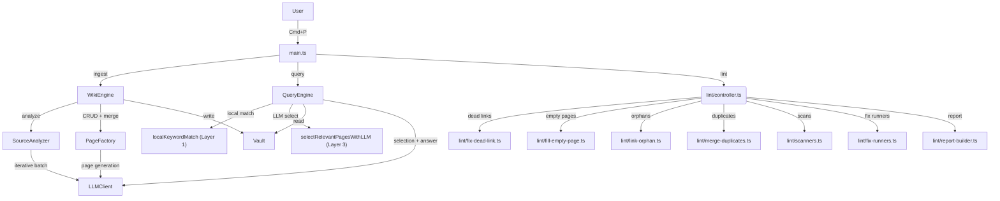

# Contributing to Karpathy LLM Wiki

Thanks for your interest in contributing! This plugin follows Obsidian's plugin development conventions and enforces quality standards through automated tooling.

## Development Setup

```bash
git clone https://github.com/green-dalii/obsidian-llm-wiki.git
cd obsidian-llm-wiki
pnpm install
```

## Building

```bash
# Development build (watch mode)
pnpm dev

# Production build
pnpm build
```

`main.js` is the compiled output loaded by Obsidian. Test by copying `main.js`, `manifest.json`, and `styles.css` into your vault's `.obsidian/plugins/karpathywiki/` folder.

## Quality Checks

All four checks must pass before submitting any change:

```bash
pnpm lint          # ESLint with Obsidian plugin rules (0 errors, 0 warnings)
pnpm test          # Vitest unit tests (all pass)
npx tsc --noEmit   # TypeScript type check (0 errors, 0 warnings) — Dual Gate
pnpm build         # esbuild production build (must exit cleanly)
```

## Code Conventions

- **TypeScript**: strict types, no `any` (use `unknown` with type guards)
- **Console**: only `console.debug` / `console.warn` / `console.error` (no `console.log`)
- **Comments**: English only, minimal — explain WHY not WHAT
- **Naming**: PascalCase classes, camelCase functions, UPPER_SNAKE_CASE constants
- **Booleans**: prefix with `is/has/can` (e.g., `isValid`, `hasContent`)
- **Commit messages**: English, conventional commits format (`feat:`, `fix:`, `docs:`, `refactor:`, `test:`, `chore:`)
- **Obsidian Bot compliance**: 15 `eslint-plugin-obsidianmd` rules enforced by `pnpm lint`
- **llmReady guard**: New core features must call `requireLLMReady()` at entry points. The plugin requires a successful connection test before core features are available.
- **i18n**: UI strings use the TEXTS system. English strings in `src/texts/en.ts` are the canonical source; all 7 other languages must be updated in lockstep.

## Project Structure

```
src/
├── main.ts              # Plugin entry point
├── types.ts             # Shared types + EngineContext
├── constants.ts         # Centralized constants (token budgets, notice durations, WIKI_SUBFOLDERS)
├── texts.ts             # i18n texts (barrel, 8 languages)
├── llm-client.ts        # LLM clients (Anthropic via requestUrl, OpenAI-compatible)
├── llm-client-wrapper.ts # Advanced settings injection wrapper
├── core/                # Pure function modules (zero IO, fully testable)
│   ├── i18n.ts                 # Type-safe i18n accessor
│   ├── slug.ts                 # Slug computation + alias filtering
│   ├── json.ts                 # JSON response parsing + repair
│   ├── frontmatter.ts          # Frontmatter parse/merge/constraints
│   ├── tag-vocab.ts            # Active tag vocabulary helpers
│   ├── index-search.ts         # Index parsing + local keyword match
│   ├── rate-limit.ts           # Rate-limit detection + notice formatting
│   ├── report.ts               # Report truncation + heading nesting
│   ├── arrays.ts               # Array coercion + source tag extraction
│   ├── markdown.ts             # Markdown response cleanup
│   ├── conflict-resolver.ts    # Conflict detection
│   ├── dead-link-detector.ts   # Dead link identification
│   ├── orphan-matcher.ts       # Orphan page matching
│   ├── prompt-builders.ts      # Prompt template builders
│   ├── sources-normalizer.ts   # Frontmatter sources field normalization
│   ├── sse-parser.ts           # Shared SSE event parser
│   ├── token-cap.ts            # max_tokens cap helper
│   ├── truncation-retry.ts     # Shared truncation retry policy
│   ├── batch-limits.ts         # Adaptive batch sizing
│   ├── batch-merger.ts         # Multi-batch result merging
│   └── convergence-detector.ts # Early-stop on low-yield batches
├── wiki/                # Wiki engine modules
│   ├── wiki-engine.ts   # Orchestrator (ingest, lint, log)
│   ├── query-engine.ts  # Conversational query with streaming
│   ├── source-analyzer.ts # Iterative batch extraction
│   ├── page-factory.ts  # Entity/concept CRUD + merge
│   ├── conversation-ingest.ts # Chat → wiki knowledge
│   ├── contradictions.ts # Contradiction detection
│   ├── system-prompts.ts # Language directive + section labels
│   ├── lint/            # Lint subsystem
│   │   ├── controller.ts         # Lint orchestration
│   │   ├── fix-runners.ts        # Batch fix execution helpers
│   │   ├── scanners.ts           # Scanners (dead links, orphans, aliases, quote grounding)
│   │   ├── duplicate-detection.ts # Programmatic candidate generation
│   │   ├── report-builder.ts     # Pure-function report markdown builder
│   │   ├── types.ts              # LintContext, LintPhaseContext, findings
│   │   ├── utils.ts              # Shared lint helpers
│   │   ├── get-existing-pages.ts # Wiki page index reader
│   │   ├── fix-dead-link.ts      # Dead-link correction
│   │   ├── fill-empty-page.ts    # Empty-page expansion
│   │   ├── delete-empty-stubs.ts # Empty stub deletion
│   │   ├── link-orphan.ts        # Orphan page linking
│   │   ├── merge-duplicates.ts   # Duplicate page merge
│   │   ├── fix-polluted-page.ts  # Polluted basename rename
│   │   └── phases/
│   │       ├── preparation.ts    # Page read, link fix, sources normalize
│   │       └── programmatic.ts   # Fast programmatic scanners
│   └── prompts/         # LLM prompt templates by domain
├── schema/              # Schema co-evolution
│   ├── schema-manager.ts # SchemaManager (read/write schema config)
│   ├── auto-maintain.ts # File watcher, periodic lint, startup quick fixes
│   └── analyze.ts       # Schema-analyze with cancel wiring
├── ui/                  # Settings + Modals
├── texts/               # i18n (8 languages)
└── __tests__/           # Unit tests (vitest, 723 tests across 50 files)
```

## Internationalization

- **UI**: 8 languages (EN/ZH/JA/KO/DE/FR/ES/PT), text keys in `src/texts/`
- **New text**: add the key to `en.ts` first, then translate to all 7 other languages (in lockstep)
- **Wiki output**: 8 languages independent of UI, with custom input option

## Testing

Unit tests cover pure utility functions in `src/__tests__/`. Run with:

```bash
pnpm test          # single run
pnpm test:watch    # watch mode
```

Functions that depend on Obsidian APIs (vault I/O, file operations) should be tested manually in Obsidian. When adding new features, include unit tests for any pure logic (parsing, transformation, validation).

## Architecture Principles

This plugin follows [Karpathy's LLM Wiki vision](https://gist.github.com/karpathy/442a6bf555914893e9891c11519de94f):

- **Knowledge compounds** — query results flow back into wiki
- **Human-in-the-loop** — LLM suggests, user decides
- **Three-layer architecture** — Sources (read-only) → Wiki (LLM-generated) → Schema (co-evolved)
- **Incremental accumulation** — wiki is persistent, not one-shot

### Architecture Overview



## Pull Request Process

1. Run `pnpm lint && pnpm test && npx tsc --noEmit && pnpm build` — all must pass
2. Add or update unit tests for any changed pure logic
3. Update CHANGELOG.md if the change is user-visible
4. Update all 8 README language variants if the change affects user-facing features or workflow
5. Update CLAUDE.md and memory files to reflect completed work
6. Commit with English conventional commit message
7. Open a PR against `main` branch

## Questions?

Open a [Discussion](https://github.com/green-dalii/obsidian-llm-wiki/discussions) or [Issue](https://github.com/green-dalii/obsidian-llm-wiki/issues).
