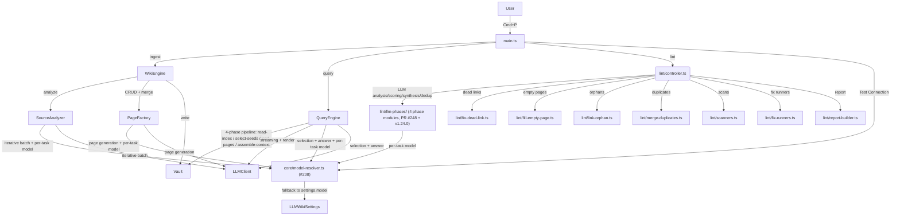

# Contributing to Karpathy LLM Wiki

Thanks for your interest in contributing! This plugin follows Obsidian's plugin development conventions and enforces quality standards through automated tooling.

## Development Setup

```bash
git clone https://github.com/green-dalii/obsidian-llm-wiki.git
cd obsidian-llm-wiki
pnpm install
```

## Building

```bash
# Development build (watch mode)
pnpm dev

# Production build
pnpm build
```

`main.js` is the compiled output loaded by Obsidian. Test by copying `main.js`, `manifest.json`, and `styles.css` into your vault's `.obsidian/plugins/karpathywiki/` folder.

## Quality Checks

All five checks must pass before submitting any change:

```bash
pnpm lint          # ESLint with Obsidian plugin rules (0 errors, 0 warnings)
pnpm test          # Vitest unit tests (all pass)
npx tsc --noEmit   # TypeScript type check (0 errors, 0 warnings) — Dual Gate
pnpm build         # esbuild production build (must exit cleanly)
pnpm css-lint      # styles.css contains no !important declarations
```

## Code Conventions

- **TypeScript**: strict types, no `any` (use `unknown` with type guards)
- **Console**: only `console.debug` / `console.warn` / `console.error` (no `console.log`)
- **Comments**: English only, minimal — explain WHY not WHAT
- **Naming**: PascalCase classes, camelCase functions, UPPER_SNAKE_CASE constants
- **Booleans**: prefix with `is/has/can` (e.g., `isValid`, `hasContent`)
- **Commit messages**: English, conventional commits format (`feat:`, `fix:`, `docs:`, `refactor:`, `test:`, `chore:`)
- **Obsidian Bot compliance**: 15 `eslint-plugin-obsidianmd` rules enforced by `pnpm lint`
- **llmReady guard**: New core features must call `requireLLMReady()` at entry points. The plugin requires a successful connection test before core features are available.
- **i18n**: UI strings use the TEXTS system. English strings in `src/texts/en.ts` are the canonical source; all 9 other languages must be updated in lockstep.

> **v1.23.0 + v1.23.1 note (2026-07-02):** `src/llm-client.ts` (1625 LOC, hand-rolled AnthropicClient / OpenAICompatibleClient / AnthropicCompatibleClient) and `src/core/sse-parser.ts` (85 LOC) have been **removed**. They are replaced by `src/llm-sdk/` (5 files, 1421 LOC) backed by Vercel AI-SDK v6 (`@ai-sdk/openai@3`, `@ai-sdk/anthropic@3`, `@ai-sdk/openai-compatible@2`, `ai@6`) and `src/core/obsidian-fetch-bridge.ts` (326 LOC). New Graph Engine modules added under `src/core/`: `monte-carlo-ppr.ts`, `ppr-cascade.ts`, `section-extractor.ts`, `hub-detection.ts`, `hub-retirement.ts`, `build-graph.ts`, `url-fallback.ts`, `build-folder-tree.ts`, `ingest-queue.ts`. v1.23.1 added `strictBindCallApply: true` to `tsconfig.json` for Obsidian review-bot alignment.

## Project Structure

```
src/
├── main.ts              # Plugin entry point
├── types.ts             # Shared types + EngineContext
├── constants.ts         # Centralized constants (token budgets, notice durations, WIKI_SUBFOLDERS)
├── texts.ts             # i18n texts (barrel, 10 languages)
├── prompts/              # LLM prompt templates by domain
├── llm-client-wrapper.ts # Advanced settings injection wrapper
├── llm-sdk/             # Vercel AI-SDK v6 client factories (v1.23.0, replaces llm-client.ts)
│   ├── create-llm-client.ts        # Factory: async + sync shim + preload
│   ├── openai-sdk-client.ts        # OpenAI via @ai-sdk/openai (Responses API for reasoning models)
│   ├── anthropic-sdk-client.ts     # Anthropic via @ai-sdk/anthropic (baseURL support for Coding Plan / z.ai / GLM)
│   ├── openai-compat-sdk-client.ts # OpenAI-compatible via @ai-sdk/openai-compatible (8 providers)
│   └── token-key-probe.ts         # max_tokens ↔ max_completion_tokens runtime fallback (KISS, no regex)
├── core/                # Pure function modules (zero IO, fully testable)
│   ├── i18n.ts                 # Type-safe i18n accessor
│   ├── slug.ts                 # Slug computation + alias filtering
│   ├── json.ts                 # JSON response parsing + repair
│   ├── frontmatter.ts          # Frontmatter parse/merge/constraints
│   ├── tag-vocab.ts            # Active tag vocabulary helpers
│   ├── index-search.ts         # Index parsing + local keyword match
│   ├── rate-limit.ts           # Rate-limit detection + notice formatting
│   ├── report.ts               # Report truncation + heading nesting
│   ├── arrays.ts               # Array coercion + source tag extraction
│   ├── markdown.ts             # Markdown cleanup + thinking block extraction/encoding
│   ├── diff.ts                 # LCS line-level diff (schema diff Modal, v1.22.0)
│   ├── detail-renderer.ts      # Wiki page detail rendering
│   ├── token-cap.ts            # max_tokens cap helper
│   ├── truncation-retry.ts     # Shared truncation retry policy
│   ├── batch-limits.ts         # Adaptive batch sizing
│   ├── batch-merger.ts         # Multi-batch result merging
│   ├── convergence-detector.ts # Early-stop on low-yield batches
│   ├── conflict-resolver.ts    # Conflict detection
│   ├── dead-link-detector.ts   # Dead link identification
│   ├── orphan-matcher.ts       # Orphan page matching
│   ├── prompt-builders.ts      # Prompt template builders
│   ├── sources-normalizer.ts   # Frontmatter sources field normalization
│   ├── source-slug.ts          # FNV-1a source-slug fingerprinting
│   ├── source-requirements.ts  # Pre-ingest content validation (#164, v1.21.0)
│   ├── status-bar.ts           # Ingest status bar text builder (v1.22.0)
│   ├── log-header.ts           # i18n log.md header builder (v1.22.2)
│   ├── log-parser.ts           # Pure-function log.md → structured data parser (v1.21.0)
│   ├── incomplete-page-cleaner.ts # Orphaned page auto-cleanup (#170, v1.21.0)
│   ├── settings-migrations.ts  # Pure-function settings migration pipeline (v1.22.1)
│   ├── backup-rotation.ts      # Schema backup rotation, max 3 (v1.22.0)
│   ├── related-link-corrector.ts # Deterministic related-link prefix correction (v1.22.1)
│   ├── localize-welcome-note.ts # D8 LLM dynamic welcome-note translation (v1.23.0)
│   ├── obsidian-fetch-bridge.ts # window.fetch bridge for real streaming (v1.23.0, 326 LOC)
│   ├── url-fallback.ts         # Custom baseURL /v1 auto-resolution (v1.23.0, 395 LOC)
│   ├── build-folder-tree.ts    # Recursive folder tree for Multi-File Ingest (v1.23.0)
│   ├── ingest-queue.ts         # IngestQueue pub/sub store (v1.23.0, Issue #130)
│   ├── build-graph.ts          # Wiki-link graph builder (v1.23.0)
│   ├── monte-carlo-ppr.ts      # Fogaras 2005 MC-PPR engine (v1.23.0)
│   ├── ppr-cascade.ts          # Hybrid 3-tier retrieval cascade (v1.23.0, 213 LOC)
│   ├── section-extractor.ts    # Zero-LLM Tier B section parser (v1.23.0)
│   ├── hub-detection.ts        # Hub-link distinctiveness scanner (v1.23.0)
│   ├── hub-link-distinctiveness.ts # Link distinctiveness scoring (v1.23.0, #157/#175)
│   ├── hub-retirement.ts       # Hub crystallization retirement signal (v1.23.0, PR #215 @DocTpoint)
│   ├── tier-detection.ts       # Three-tier onboarding decision logic (v1.23.0)
│   ├── welcome-note-template.ts # Welcome note template builder (v1.23.0)
│   ├── ensure-welcome-note.ts  # First-run Welcome note orchestrator (v1.23.0)
│   ├── smoke-test.ts           # LLM configuration verification wrapper (v1.23.0)
│   ├── transient-retry.ts      # Project-wide withTransientRetry<T> helper (v1.24.0, 3× exp backoff)
│   └── model-resolver.ts       # resolveModelForTask(settings, task) #208 per-task routing helper (v1.24.0)
├── wiki/                # Wiki engine modules
│   ├── wiki-engine.ts   # Orchestrator (ingest, lint, log)
│   ├── query-engine/    # Conversational query with streaming + thinking UI
│   │   ├── index.ts                           # re-export shim
│   │   ├── types.ts + state.ts                # type declarations + InternalView
│   │   ├── QueryView-class.ts                 # ItemView (+ delegates renderers + pipeline)
│   │   ├── SuggestSaveModal-class.ts          # post-query feedback Modal
│   │   ├── renderers/                         # 6 pure-function modules
│   │   └── pipeline/                          # 5 pure-function modules
│   ├── source-analyzer.ts # Iterative batch extraction
│   ├── page-factory/          # Entity/concept CRUD + merge (10 modules, v1.24.1 split)
│   │   ├── index.ts                # Facade (preserves public API)
│   │   ├── aliases.ts              # appendAliases
│   │   ├── complementary-appends.ts # Tier-2 per-section appends
│   │   ├── contextualize.ts        # 5 module-level helpers
│   │   ├── create-page.ts          # 4 create functions
│   │   ├── mentions-integration.ts # assembleFinalContent
│   │   ├── merge-page.ts           # mergePage + appendToReviewedPage
│   │   ├── merge-triage.ts         # classifyMergeNeed + buildNewInfoSummary
│   │   ├── path-resolution.ts      # resolvePagePath + buildPagesListForPrompt
│   │   └── related-page.ts         # updateRelatedPage (3-branch routing)
│   ├── conversation-ingest.ts # Chat → wiki knowledge
│   ├── contradictions.ts # Contradiction detection
│   ├── system-prompts.ts # Language directive + section labels
│   ├── turn-indicator.ts # Right-edge vertical dot conversation nav (v1.23.2, #221)
│   ├── lint/            # Lint subsystem
│   │   ├── controller.ts         # Lint orchestration + 3 phase modules
│   │   ├── fix-runners.ts        # Batch fix execution helpers
│   │   ├── scanners.ts           # Scanners (dead links, orphans, aliases, quote grounding)
│   │   ├── duplicate-detection.ts # Programmatic candidate generation
│   │   ├── report-builder.ts     # Pure-function report markdown builder
│   │   ├── types.ts              # LintContext, LintPhaseContext, findings
│   │   ├── utils.ts              # Shared lint helpers
│   │   ├── get-existing-pages.ts # Wiki page index reader
│   │   ├── fix-dead-link.ts      # Dead-link correction
│   │   ├── fill-empty-page.ts    # Empty-page expansion
│   │   ├── delete-empty-stubs.ts # Empty stub deletion
│   │   ├── link-orphan.ts        # Orphan page linking
│   │   ├── merge-duplicates.ts   # Duplicate page merge
│   │   ├── fix-polluted-page.ts  # Polluted basename rename
│   │   ├── llm-phases/
│   │   │   ├── analysis-phase.ts    # Tier-1+Tier-2 merge analysis (#216, v1.24.0)
│   │   │   ├── scoring-phase.ts     # PR #248
│   │   │   ├── synthesis-phase.ts   # PR #248
│   │   │   └── dedup-phase.ts       # lint dedup phase with #207 system-field injection (v1.24.0)
│   │   └── phases/
│   │       ├── preparation.ts    # Page read, link fix, sources normalize
│   │       └── programmatic.ts   # Fast programmatic scanners
│   └── prompts/         # LLM prompt templates by domain
├── schema/              # Schema co-evolution
│   ├── schema-manager.ts # SchemaManager (read/write schema config)
│   ├── auto-maintain.ts # File watcher, periodic lint, startup quick fixes
│   └── analyze.ts       # Schema-analyze with cancel wiring
├── ui/                  # Settings + history-modal/ (14-file split, v1.24.0) + modals/ (7-file split, v1.24.0)
├── texts/               # i18n (10 languages: EN/ZH/ZH-Hant/JA/KO/DE/FR/ES/PT/IT)
└── __tests__/           # Unit tests (vitest, 2080 tests across 158 files)
```

## Internationalization

- **UI**: 10 languages (EN/ZH/ZH-Hant/JA/KO/DE/FR/ES/PT/IT), text keys in `src/texts/`
- **New text**: add the key to `en.ts` first, then translate to all 9 other languages (in lockstep). The i18n-parity test (`src/__tests__/root/i18n-parity.test.ts`) prevents silent EN fallback if a locale is missing keys.
- **Wiki output**: 10 languages independent of UI, with custom input option

## Testing

Unit tests cover pure utility functions in `src/__tests__/`. Run with:

```bash
pnpm test          # single run
pnpm test:watch    # watch mode
```

Functions that depend on Obsidian APIs (vault I/O, file operations) should be tested manually in Obsidian. When adding new features, include unit tests for any pure logic (parsing, transformation, validation).

## Architecture Principles

This plugin follows [Karpathy's LLM Wiki vision](https://gist.github.com/karpathy/442a6bf555914893e9891c11519de94f):

- **Knowledge compounds** — query results flow back into wiki
- **Human-in-the-loop** — LLM suggests, user decides
- **Three-layer architecture** — Sources (read-only) → Wiki (LLM-generated) → Schema (co-evolved)
- **Incremental accumulation** — wiki is persistent, not one-shot

### Architecture Overview



## Pull Request Process

1. Run `pnpm lint && pnpm test && npx tsc --noEmit && pnpm build` — all must pass
2. Add or update unit tests for any changed pure logic
3. Update CHANGELOG.md if the change is user-visible
4. Update all 10 README language variants if the change affects user-facing features or workflow
5. Update CLAUDE.md and memory files to reflect completed work
6. Commit with English conventional commit message
7. Open a PR against `main` branch

## 📜 License & DCO

This project is licensed under the **Apache License, Version 2.0**. See [LICENSE](../LICENSE) for the full text and [NOTICE](../NOTICE) for contributor attribution.

### Developer Certificate of Origin (DCO)

By contributing to this project, you agree that your contribution is licensed under the Apache License, Version 2.0. We follow the Developer Certificate of Origin v1.1 (https://developercertificate.org/).

All commits submitted via pull request **should** include a `Signed-off-by:` line:

```
feat: add example feature

Signed-off-by: Your Name <your.email@example.com>
```

You can add this automatically with:

```bash
git commit -s
```

The sign-off certifies that either:

- you wrote the contribution and have the right to submit it, or
- you are submitting it on behalf of someone else who has authorized you to do so.

Maintainers may ask for clarification if a commit lacks a sign-off. We do not retroactively require DCO sign-off for contributions made before this policy was adopted.

## Questions?

Open a [Discussion](https://github.com/green-dalii/obsidian-llm-wiki/discussions) or [Issue](https://github.com/green-dalii/obsidian-llm-wiki/issues).
