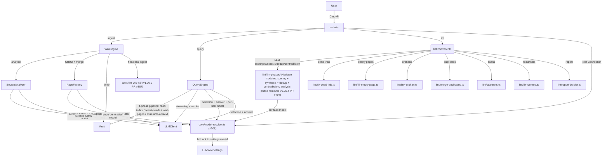

# Contributing to Karpathy LLM Wiki

Thanks for your interest in contributing! This plugin follows Obsidian's plugin development conventions and enforces quality standards through automated tooling.

## Development Setup

```bash
git clone https://github.com/green-dalii/obsidian-llm-wiki.git
cd obsidian-llm-wiki
pnpm install
```

## Building

```bash
# Development build (watch mode)
pnpm dev

# Production build
pnpm build
```

`main.js` is the compiled output loaded by Obsidian. Test by copying `main.js`, `manifest.json`, and `styles.css` into your vault's `.obsidian/plugins/karpathywiki/` folder.

## Quality Checks

All five checks must pass before submitting any change. **Order is non-negotiable: build before test** — `openai-codex-loopback-flow.test.ts:39` reads `main.js` to verify esbuild bundle shape, so a test-before-build run on a fresh clone fails ENOENT:

```bash
pnpm lint          # ESLint with Obsidian plugin rules (0 errors, 0 warnings)
npx tsc --noEmit   # TypeScript type check (0 errors, 0 warnings) — Dual Gate
pnpm build         # esbuild production build (must exit cleanly)
pnpm test          # Vitest unit tests (all pass)
pnpm css-lint      # styles.css contains no !important declarations
```

The composite alias `pnpm gate:1` runs all five in the correct order.

## Code Conventions

- **TypeScript**: strict types, no `any` (use `unknown` with type guards)
- **Console**: only `console.debug` / `console.warn` / `console.error` (no `console.log`)
- **Comments**: English only, minimal — explain WHY not WHAT
- **Naming**: PascalCase classes, camelCase functions, UPPER_SNAKE_CASE constants
- **Booleans**: prefix with `is/has/can` (e.g., `isValid`, `hasContent`)
- **Commit messages**: English, conventional commits format (`feat:`, `fix:`, `docs:`, `refactor:`, `test:`, `chore:`)
- **Obsidian Bot compliance**: 15 `eslint-plugin-obsidianmd` rules enforced by `pnpm lint`
- **llmReady guard**: New core features must call `requireLLMReady()` at entry points. The plugin requires a successful connection test before core features are available.
- **i18n**: UI strings use the TEXTS system. English strings in `src/texts/en.ts` are the canonical source; all 9 other languages must be updated in lockstep.

> **Historical release notes** (v1.23.0+llm-client removal, v1.24.0 splits, v1.24.1 Bedrock + PPR + page-factory, v1.25.0 PDF Ingest): see [CHANGELOG.md](../CHANGELOG.md). Keep a Changelog format is the canonical record; this file documents the project structure as it stands.

## Project Structure

```
src/
├── main.ts              # Plugin entry point
├── main-commands/       # Entry-point mixins, including Codex OAuth lifecycle commands
├── types.ts             # Shared types + EngineContext
├── constants.ts         # Centralized constants (token budgets, notice durations, WIKI_SUBFOLDERS)
├── texts.ts             # i18n texts (barrel, 11 locales: EN canonical + 10 translations)
├── prompts/              # LLM prompt templates by domain
├── llm-client-wrapper.ts # Advanced settings injection wrapper
├── llm-sdk/             # Vercel AI-SDK v6 client factories (v1.23.0, replaces llm-client.ts)
│   ├── create-llm-client.ts        # Factory: async + sync shim + preload
│   ├── openai-sdk-client.ts        # OpenAI via @ai-sdk/openai (Responses API for reasoning models)
│   ├── anthropic-sdk-client.ts     # Anthropic via @ai-sdk/anthropic (baseURL support for Coding Plan / z.ai / GLM)
│   ├── openai-compat-sdk-client.ts # OpenAI-compatible via @ai-sdk/openai-compatible (8 providers)
│   ├── openai-codex-sdk-client.ts  # ChatGPT Plan (Codex OAuth) — separate Codex Responses client (v1.25.2, OAuth device-code + loopback)
│   ├── openai-codex/               # Codex OAuth private modules (adapter + token store)
│   ├── reasoning-strip-probe.ts    # Per-baseURL 400-strip cache + two-marker (verb+field) classifier (v1.26.0 Batch 6)
│   ├── token-key-probe.ts          # max_tokens ↔ max_completion_tokens runtime fallback (KISS, no regex)
│   ├── sampling-args.ts            # Shared sampling-args builder for cross-SDK createMessage (v1.26.0)
│   ├── provider-api-key-resolver.ts # resolveProviderApiKey + resolveInitialApiKey precedence (v1.25.7, #182)
│   ├── provider-secret-store.ts    # Obsidian SecretStorage adapter (v1.25.3)
│   └── finish-reason.ts            # Shared finish-reason extraction helper
├── core/                # Pure function modules (zero IO, fully testable)
│   ├── i18n.ts                 # Type-safe i18n accessor
│   ├── slug.ts                 # Slug computation + alias filtering
│   ├── json.ts                 # JSON response parsing + repair
│   ├── frontmatter.ts          # Frontmatter parse/merge/constraints
│   ├── tag-vocab.ts            # Active tag vocabulary helpers
│   ├── index-search.ts         # Index parsing + local keyword match
│   ├── rate-limit.ts           # Rate-limit detection + notice formatting
│   ├── report.ts               # Report truncation + heading nesting
│   ├── arrays.ts               # Array coercion + source tag extraction
│   ├── markdown.ts             # Markdown cleanup + thinking block extraction/encoding
│   ├── diff.ts                 # LCS line-level diff (schema diff Modal, v1.22.0)
│   ├── detail-renderer.ts      # Wiki page detail rendering
│   ├── token-cap.ts            # max_tokens cap helper
│   ├── truncation-retry.ts     # Shared truncation retry policy
│   ├── batch-limits.ts         # Adaptive batch sizing
│   ├── batch-merger.ts         # Multi-batch result merging
│   ├── convergence-detector.ts # Early-stop on low-yield batches
│   ├── dead-link-detector.ts   # Dead link identification
│   ├── orphan-matcher.ts       # Orphan page matching
│   ├── prompt-builders.ts      # Prompt template builders
│   ├── sources-normalizer.ts   # Frontmatter sources field normalization
│   ├── source-slug.ts          # FNV-1a source-slug fingerprinting
│   ├── source-requirements.ts  # Pre-ingest content validation (#164, v1.21.0)
│   ├── status-bar.ts           # Ingest status bar text builder (v1.22.0)
│   ├── log-header.ts           # i18n log.md header builder (v1.22.2)
│   ├── log-parser.ts           # Pure-function log.md → structured data parser (v1.21.0)
│   ├── incomplete-page-cleaner.ts # Orphaned page auto-cleanup (#170, v1.21.0)
│   ├── settings-migrations.ts  # Pure-function settings migration pipeline (v1.22.1)
│   ├── backup-rotation.ts      # Schema backup rotation, max 3 (v1.22.0)
│   ├── related-link-corrector.ts # Deterministic related-link prefix correction (v1.22.1, full-vault resolver v1.26.4 PR #484)
│   ├── localize-welcome-note.ts # D8 LLM dynamic welcome-note translation (v1.23.0)
│   ├── obsidian-fetch-bridge.ts # window.fetch bridge for real streaming (v1.23.0, 326 LOC)
│   ├── url-fallback.ts         # Custom baseURL /v1 auto-resolution (v1.23.0, 395 LOC)
│   ├── build-folder-tree.ts    # Recursive folder tree for Multi-File Ingest (v1.23.0)
│   ├── ingest-queue.ts         # IngestQueue pub/sub store (v1.23.0, Issue #130)
│   ├── build-graph.ts          # Wiki-link graph builder (v1.23.0)
│   ├── monte-carlo-ppr.ts      # Fogaras 2005 MC-PPR engine (v1.23.0)
│   ├── ppr-cascade.ts          # Hybrid 3-tier retrieval cascade (v1.23.0, 213 LOC)
│   ├── section-extractor.ts    # Zero-LLM Tier B section parser (v1.23.0)
│   ├── hub-detection.ts        # Hub-link distinctiveness scanner (v1.23.0)
│   ├── hub-link-distinctiveness.ts # Link distinctiveness scoring (v1.23.0, #157/#175)
│   ├── hub-retirement.ts       # Hub crystallization retirement signal (v1.23.0, PR #215 @DocTpoint)
│   ├── tier-detection.ts       # Three-tier onboarding decision logic (v1.23.0)
│   ├── welcome-note-template.ts # Welcome note template builder (v1.23.0)
│   ├── ensure-welcome-note.ts  # First-run Welcome note orchestrator (v1.23.0)
│   ├── smoke-test.ts           # LLM configuration verification wrapper (v1.23.0)
│   ├── transient-retry.ts      # Project-wide withTransientRetry<T> helper (v1.24.0, 3× exp backoff)
│   ├── model-resolver.ts       # resolveModelForTask(settings, task) #208 per-task routing helper (v1.24.0)
│   ├── pdf-cache.ts            # Content-hash PDF conversion cache + LRU eviction (v1.25.0)
│   ├── pdf-converter.ts        # PDF→Markdown via LLM FilePart + OCR-style prompt (v1.25.0)
│   ├── pdf-metadata.ts         # Pure-function PDF Info dict parser (title/author/pageCount, v1.25.0)
│   ├── folder-scope.ts         # Folder-boundary predicate (#364, v1.25.10) — anchor on trailing slash, root wildcard
│   ├── contradicted-marker.ts  # `contradictions:` frontmatter marker (#312 §4, v1.25.10)
│   ├── source-language.ts      # Source-frontmatter language directive builder (#350 follow-on, v1.25.10)
│   ├── template-renderer.ts    # {{placeholder}} substitution with named keys (#244/v1.25.10)
│   ├── source-lemma.ts         # Source-slug = page-lemma deterministic merge (#348, v1.26.0 PR #357 DocTpoint)
│   ├── link-retarget.ts        # Vault-wide link retarget for mergeDuplicates (#386, v1.26.0 PR #392 DocTpoint)
│   ├── llm-task-usage.ts       # Per-step LLM call + wall-time ledger (PR #409, v1.26.1 eucher)
│   ├── clamp-page-sections.ts  # Section-shaped page clamp + withhold/restore for contradiction rewrite (#287 follow-on, v1.26.4 PR #492)
│   ├── task-policy.ts          # Per-step output mode + thinking policy (#481, v1.26.4 PR #490) — settings taskPolicies
├── wiki/                # Wiki engine modules
│   ├── wiki-engine.ts   # Orchestrator (ingest, lint, log) — v1.25.1: 4 internal modules extracted
│   ├── graph-cache.ts   # (v1.25.1) `_cachedGraph` + invalidate logic
│   ├── index-generation.ts # (v1.25.1) generateFlatIndex + helpers
│   ├── log-writer.ts    # (v1.25.1) updateLog + formatters
│   ├── query-engine/    # Conversational query with streaming + thinking UI
│   │   ├── index.ts                           # re-export shim
│   │   ├── types.ts + state.ts                # type declarations + InternalView
│   │   ├── QueryView-class.ts                 # ItemView (+ delegates renderers + pipeline)
│   │   ├── SuggestSaveModal-class.ts          # post-query feedback Modal
│   │   ├── renderers/                         # 6 pure-function modules
│   │   └── pipeline/                          # 5 pure-function modules
│   ├── source-analyzer.ts # Iterative batch extraction
│   ├── page-factory/          # Entity/concept CRUD + merge (10 modules, v1.24.1 split)
│   │   ├── index.ts                # Facade (preserves public API)
│   │   ├── aliases.ts              # appendAliases
│   │   ├── complementary-appends.ts # Tier-2 per-section appends
│   │   ├── contextualize.ts        # 5 module-level helpers
│   │   ├── create-page.ts          # 4 create functions
│   │   ├── mentions-integration.ts # assembleFinalContent
│   │   ├── merge-page.ts           # mergePage + appendToReviewedPage
│   │   ├── merge-triage.ts         # classifyMergeNeed + buildNewInfoSummary
│   │   ├── path-resolution.ts      # resolvePagePath + buildPagesListForPrompt
│   │   └── related-page.ts         # updateRelatedPage (3-branch routing)
│   ├── conversation-ingest.ts # Chat → wiki knowledge
│   ├── contradictions.ts # Contradiction detection
│   ├── system-prompts.ts # Language directive + section labels
│   ├── turn-indicator.ts # Right-edge vertical dot conversation nav (v1.23.2, #221)
│   ├── lint/            # Lint subsystem
│   │   ├── controller.ts         # Lint orchestration + 3 phase modules
│   │   ├── fix-runners.ts        # Batch fix execution helpers (pageGenerationConcurrency batching, v1.25.10 PATCH #367)
│   │   ├── scanners.ts           # Scanners (dead links, orphans, aliases, quote grounding)
│   │   ├── duplicate-detection.ts # Programmatic candidate generation — dual-key bucketed dedup (v1.26.0 Batch 1, PR #401)
│   │   ├── lint-analysis-context.ts # Phase context shared by analysis + dedup phases (v1.26.0)
│   │   ├── report-builder.ts     # Pure-function report markdown builder
│   │   ├── types.ts              # LintContext, LintPhaseContext, findings
│   │   ├── utils.ts              # Shared lint helpers
│   │   ├── get-existing-pages.ts # Wiki page index reader
│   │   ├── fix-dead-link.ts      # Dead-link correction
│   │   ├── fill-empty-page.ts    # Empty-page expansion (created: from caller, #388, v1.26.0 PR #396)
│   │   ├── delete-empty-stubs.ts # Empty stub deletion
│   │   ├── link-orphan.ts        # Orphan page linking
│   │   ├── merge-duplicates.ts   # Duplicate page merge (vault-wide link retarget, #386, v1.26.0 PR #392 DocTpoint)
│   │   ├── fix-polluted-page.ts  # Polluted basename rename
│   │   ├── llm-phases/
│   │   │   ├── scoring-phase.ts     # PR #248
│   │   │   ├── synthesis-phase.ts   # PR #248
│   │   │   ├── dedup-phase.ts       # Lint dedup phase — inline retry/backoff/halving + force-disable thinking (v1.26.0 Batches 2+6+7)
│   │   │   └── contradiction-phase.ts # Contradiction detection phase (v1.26.0)
│   │   └── phases/
│   │       ├── preparation.ts    # Page read, link fix, sources normalize
│   │       └── programmatic.ts   # Fast programmatic scanners
│   └── prompts/         # LLM prompt templates by domain (INGESTION / GENERATION / MERGE / FIX / LINT / CONVERSATION / PDF, v1.25.0)
│       ├── ingestion.ts
│       ├── generation.ts
│       ├── merge.ts
│       ├── fixes.ts
│       ├── lint.ts
│       ├── conversation.ts
│       └── pdf.ts        # OCR-style verbatim transcriber + unwrapFencedMarkdown helper (v1.25.0)
├── schema/              # Schema co-evolution
│   ├── schema-manager.ts # SchemaManager (read/write schema config)
│   ├── auto-maintain.ts # File watcher, periodic lint, startup quick fixes
│   └── analyze.ts       # Schema-analyze with cancel wiring
├── ui/                  # Settings + history-modal/ (14-file split, v1.24.0) + modals/ (7-file split, v1.24.0)
│   ├── settings.ts      # LLMWikiSettingTab + tempSettings (v1.25.1: split into 10 settings-sections/ + helpers)
│   ├── settings-helpers.ts        # Pure helpers (commitTempSettings logic, classification, etc.)
│   ├── settings-per-task-helpers.ts # Per-task model dropdown rendering (v1.24.0)
│   ├── settings-sections/  # Per-section renderers, v1.25.1 + v1.26.0
│   │   ├── shared-inputs.ts            # Consolidated renderNumberInput (v1.26.0)
│   │   ├── advanced-section.ts         # LLM Advanced (Custom mode: temperature, repetitionPenalty, forcePdfSupport)
│   │   ├── advanced-settings-section.ts # Bottom "Advanced settings" panel — dedup thresholds + lintDedupIncludeSources (v1.26.0)
│   │   ├── provider-section.ts
│   │   ├── model-section.ts
│   │   ├── language-section.ts
│   │   ├── status-section.ts
│   │   ├── test-connection-section.ts
│   │   ├── auto-maintain-section.ts
│   │   └── wiki-config-section.ts
│   ├── history-modal/  # 13 files (v1.24.0 split)
│   │   ├── HistoryModal-class.ts
│   │   └── renderers/  # 13 pure-function modules (entry, ingest-details, fix-details, etc.)
│   ├── modals/          # 7+ files: MultiFileSuggestModal, FolderSuggest, etc.
│   ├── tag-chip-input.ts
│   └── schema-diff-modal.ts
├── texts/               # i18n (11 locales: EN canonical + ZH/ZH-Hant/JA/KO/DE/FR/ES/PT/IT/RU; Russian added v1.26.0 PR #397)
└── __tests__/           # Unit tests (vitest, 3677 tests / 260 files; v1.27.0 MINOR release-prep)

tools/                  # CLI toolchain (in-tree, ships via package.json bin) — see also the standalone sibling repo
└── llm-wiki-cli/       # Headless ingest CLI (v1.26.0, PRs #372 + #387)
    ├── run-llm-wiki.mjs # Executable entry point (`pnpm llm-wiki`)
    ├── README.md        # CLI flag reference (deprecated path — see obsidian-llm-wiki-cli)
    ├── tsconfig.json    # Separate tsconfig (@types/node@22)
    └── src/
        ├── main.ts          # dispatchCli + parseCliOptions + runIngest (v1.26.0, 671 LOC)
        ├── node-globals.ts  # dynamic `node:module` + createRequire guard (Platform.isDesktop-style boundary)
        ├── node-util.d.ts   # Ambient @types/node@22 module declarations
        ├── obsidian.ts      # Obsidian API shim used by the CLI (vault + app stubs)
        └── vault.ts         # Node `fs/promises` vault adapter (read/write/list)
```

> **Note on `tools/llm-wiki-cli/` (current authoritative CLI, scheduled to move):** The in-tree CLI is the **current user-facing install path** — `pnpm llm-wiki` (or `node tools/llm-wiki-cli/run-llm-wiki.mjs ingest ...`) is the only way to run the ingest pipeline headlessly until the v1.27.0 Coexist phase ships. It is scheduled to move to a standalone sibling repo ([`green-dalii/obsidian-llm-wiki-cli`](https://github.com/green-dalii/obsidian-llm-wiki-cli)) under npm package name `karpathywiki-cli` (see [SPEC v2.0](https://github.com/green-dalii/obsidian-llm-wiki-cli/blob/main/SPEC.md) and [ROADMAP v1.27.0 CLI split](ROADMAP.md#v1270-minor-design-track)). The sibling repo is at **v0.1.0-dev, NOT yet published to npm** as of 2026-08-13. After the v1.28.0 Demote phase, the in-tree `tools/llm-wiki-cli/` becomes a **dev-only test harness** referencing `../../src/` — not a user-facing CLI. Until then, `tools/llm-wiki-cli/` is the canonical CLI source.

## Internationalization

- **UI**: 11 locales (EN canonical + ZH/ZH-Hant/JA/KO/DE/FR/ES/PT/IT/RU; Russian added v1.26.0 PR #397), text keys in `src/texts/`. `en.ts` is the canonical source; `texts.ts` is the barrel.
- **New text**: add the key to `en.ts` first, then translate to all 10 other languages (in lockstep). The i18n-parity test (`src/__tests__/root/i18n-parity.test.ts`) prevents silent EN fallback if a locale is missing keys.
- **Wiki output**: 11 languages independent of UI, with custom input option

## Testing

Unit tests cover pure utility functions in `src/__tests__/`. Run with:

```bash
pnpm test          # single run
pnpm test:watch    # watch mode
```

Functions that depend on Obsidian APIs (vault I/O, file operations) should be tested manually in Obsidian. When adding new features, include unit tests for any pure logic (parsing, transformation, validation).

## Architecture Principles

This plugin follows [Karpathy's LLM Wiki vision](https://gist.github.com/karpathy/442a6bf555914893e9891c11519de94f):

- **Knowledge compounds** — query results flow back into wiki
- **Human-in-the-loop** — LLM suggests, user decides
- **Three-layer architecture** — Sources (read-only) → Wiki (LLM-generated) → Schema (co-evolved)
- **Incremental accumulation** — wiki is persistent, not one-shot

### Architecture Overview


```mermaid
graph TD
    User -->|Cmd+P| main.ts
    main.ts -->|ingest| WikiEngine
    main.ts -->|query| QueryEngine
    main.ts -->|lint| lint("lint/controller.ts + 4 LLM phase modules")
    main.ts -->|Test Connection| modelResolver["core/model-resolver.ts (#208)"]

    WikiEngine -->|analyze| SourceAnalyzer
    WikiEngine -->|CRUD + merge| PageFactory
    WikiEngine -->|write| Vault
    WikiEngine -->|headless ingest| llmWikiCli["tools/llm-wiki-cli/ (v1.26.0 PR #387)"]

    QueryEngine -->|4-phase pipeline: read-index / select-seeds / load-pages / assemble-context| Vault
    QueryEngine -->|streaming + render| LLMClient

    lint("lint/controller.ts") -->|LLM scoring/synthesis/dedup/contradiction| llm-phases["lint/llm-phases/ (4 phase modules: scoring + synthesis + dedup + contradiction; analysis-phase removed v1.26.4 PR #494)"]
    lint("lint/controller.ts") -->|dead links| fix-dead-link["lint/fix-dead-link.ts"]
    lint("lint/controller.ts") -->|empty pages| fill-empty-page["lint/fill-empty-page.ts"]
    lint("lint/controller.ts") -->|orphans| link-orphan["lint/link-orphan.ts"]
    lint("lint/controller.ts") -->|duplicates| merge-duplicates["lint/merge-duplicates.ts"]
    lint("lint/controller.ts") -->|scans| scanners["lint/scanners.ts"]
    lint("lint/controller.ts") -->|fix runners| fix-runners["lint/fix-runners.ts"]
    lint("lint/controller.ts") -->|report| report-builder["lint/report-builder.ts"]

    SourceAnalyzer -->|iterative batch + per-task model| modelResolver
    PageFactory -->|page generation + per-task model| modelResolver
    QueryEngine -->|selection + answer + per-task model| modelResolver
    llm-phases -->|per-task model| modelResolver
    modelResolver -->|fallback to settings.model| settings["LLMWikiSettings"]

    SourceAnalyzer -->|iterative batch| LLMClient
    PageFactory -->|page generation| LLMClient
    QueryEngine -->|selection + answer| LLMClient
```

### Core Design Patterns

These four patterns appear throughout the engine. New contributors should recognize them before reading the code:

- **Tier 1/2 duplicate detection** — Tier 1 candidates are always LLM-verified (high-precision, low-recall); Tier 2 fills the remaining token budget (lower-precision, higher-recall). Implemented in `src/wiki/lint/duplicate-detection.ts` (`classifyTiers`) and used by `dedup-phase.ts`.
- **`Promise.allSettled` error isolation** — One failed batch in a parallel scan does not crash the entire batch. Standard pattern in `dedup-phase.ts` and all parallel fix-runners.
- **Pollution defense at write gate** — A centralised regex catches polluted `sources:`` frontmatter before any vault write. Single source of truth at `src/wiki/source-safety.ts` (or equivalent). Don't bypass it with inline checks.
- **LLM semantic page selection** — Seed selection uses meaning-based matching (LLM or heuristic), not keyword match. Implemented in `query-engine.ts` seed selection.

## Pull Request Process

1. Run `pnpm lint && pnpm test && npx tsc --noEmit && pnpm build` — all must pass
2. Add or update unit tests for any changed pure logic
3. Update CHANGELOG.md if the change is user-visible
4. Update all 11 README language variants if the change affects user-facing features or workflow
5. Update CLAUDE.md and memory files to reflect completed work
6. Commit with English conventional commit message
7. Open a PR against `main` branch

## 📜 License & DCO

This project is licensed under the **Apache License, Version 2.0**. See [LICENSE](../LICENSE) for the full text and [NOTICE](../NOTICE) for contributor attribution.

### Developer Certificate of Origin (DCO)

By contributing to this project, you agree that your contribution is licensed under the Apache License, Version 2.0. We follow the Developer Certificate of Origin v1.1 (https://developercertificate.org/).

All commits submitted via pull request **should** include a `Signed-off-by:` line:

```
feat: add example feature

Signed-off-by: Your Name <your.email@example.com>
```

You can add this automatically with:

```bash
git commit -s
```

The sign-off certifies that either:

- you wrote the contribution and have the right to submit it, or
- you are submitting it on behalf of someone else who has authorized you to do so.

Maintainers may ask for clarification if a commit lacks a sign-off. We do not retroactively require DCO sign-off for contributions made before this policy was adopted.

## Questions?

Open a [Discussion](https://github.com/green-dalii/obsidian-llm-wiki/discussions) or [Issue](https://github.com/green-dalii/obsidian-llm-wiki/issues).
