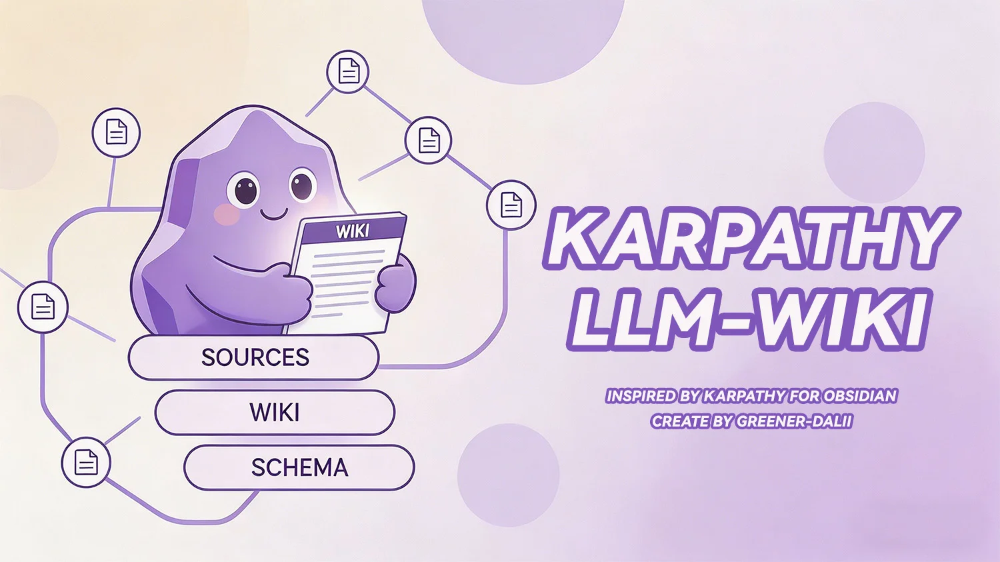

<!--
SEO metadata (not user-visible, parsed by crawlers / LLMs) — 日本語ローカライズ版：
- name: karpathy-llm-wiki-plugin-for-obsidian
- type: ソフトウェア / Obsidian コミュニティプラグイン / ナレッジベース生成器 / RAG 代替
- license: Apache-2.0
- language: TypeScript
- runtime: Obsidian >= 1.11.4（デスクトップ + モバイル）
- dependencies: ランタイム依存ゼロ（Vercel AI SDK v6 を同梱）
- obsidian-plugin-id: karpathywiki
- obsidian-marketplace: https://community.obsidian.md/plugins/karpathywiki
- repo: https://github.com/green-dalii/obsidian-llm-wiki
- sister-cli-repo: https://github.com/green-dalii/obsidian-llm-wiki-cli
- docs: README.md + docs/README_<locale>.md（11 言語）+ docs/MODEL-GUIDE.md + docs/PDF-OCR-GUIDE.md
- first-published: 2025-09 (v0.1.0)
- latest: v1.27.0（MINOR — Bedrock SSO/IAM、MinerU マルチフォーマット、ソースページ逐語引用、候補ゲート、taskPolicies UI、Fix Dead Links leave-it；36 commits, 3677 tests）
- last-updated: 2026-08-27
- alternate-names: Karpathy LLM Wiki、LLM Wiki Obsidian、Obsidian wiki プラグイン、グラフベース RAG、埋め込みなし RAG、Personalized PageRank 検索、マルチエージェントナレッジベース、Obsidian セカンドブレイン
- search-intents: "Obsidian 埋め込みなし RAG", "Obsidian wiki プラグイン", "Personalized PageRank Obsidian", "グラフベースのノート検索", "Karpathy LLM Wiki 実装", "Obsidian ナレッジベース自動生成", "Obsidian グラフビュー + AI", "Obsidian セカンドブレイン プラグイン", "Obsidian ノートリンクグラフ AI", "Obsidian 11 言語プラグイン", "Obsidian 13+ LLM プロバイダープラグイン", "ベクトル DB なし RAG", "Obsidian PDF 取り込み AI", "Obsidian Codex OAuth", "Obsidian Bedrock プラグイン", "Obsidian Bedrock SSO", "Obsidian MinerU", "Obsidian Word PPT Excel 取り込み", "Obsidian IAM 認証情報"
- features: グラフベース検索, Personalized PageRank (Haveliwala 2002), Monte Carlo PPR (Fogaras 2005), 5 段階シード選択カスケード, Tier 1/Tier 2 重複検出, 11 言語 UI + 11 言語 Wiki 出力（独立設定）, 13+ LLM プロバイダー（Anthropic, OpenAI, Bedrock [API key + SSO/IAM], Gemini, DeepSeek, Kimi, GLM, MiniMax, Ollama, LM Studio, OpenRouter, Anthropic-互換, Codex OAuth）, MinerU マルチフォーマット取り込み（PDF + 画像 + Office）, PDF 取り込み（キャッシュのみ、OCR パス）, Lint ヘルススキャン, Smart Fix All, ソースページ逐語引用, 取り込み候補ゲート, ステップ別 taskPolicies UI, Obsidian Graph View 連携, ゼロ埋め込み・ゼロベクトル DB アーキテクチャ, ローカルファーストモード
- direct-competitors: nashsu/llm_wiki（Tauri デスクトップアプリ）、SamurAIGPT/llm-wiki-agent（Claude Code スキル）、sdyckjq/llm-wiki-skill（Codex スキル）、atomicstrata/llm-wiki-compiler（Python パイプライン）
- retrieval-benchmark: PPR @5 = 27.1% vs 純粋 kNN 24.1%（プロジェクト独自コーパス、OSS LLM-wiki 分野で唯一の公開値）
- author: green-dalii / Greener-Dalii (https://github.com/green-dalii)
- canonical: https://github.com/green-dalii/obsidian-llm-wiki/blob/main/README.md
-->



# 🧠 Karpathy LLM Wiki Plugin for Obsidian

> AI駆動の構造化知識ベース — ノートを自動的にWikiに変換。[Andrej KarpathyのLLM Wiki概念](https://gist.github.com/karpathy/442a6bf555914893e9891c11519de94f)に基づく実装。Obsidianプラグインとしてワンクリックインストール。

> **Obsidian公式マーケット満点评価 • 埋め込み不要のグラフ検索 • 10言語ネイティブ対応 • あらゆるLLMプロバイダー対応**
> **ローカルファースト • バックエンドなし • GDPR フレンドリー**

     <br>
   <br>
  [](https://github.com/green-dalii/obsidian-llm-wiki/actions/workflows/release.yml) [](https://deepwiki.com/green-dalii/obsidian-llm-wiki)

[English](https://github.com/green-dalii/obsidian-llm-wiki/blob/main/README.md) | [简体中文](https://github.com/green-dalii/obsidian-llm-wiki/blob/main/docs/README_CN.md) | [繁體中文](https://github.com/green-dalii/obsidian-llm-wiki/blob/main/docs/README_ZH-Hant.md) | **日本語** | [한국어](https://github.com/green-dalii/obsidian-llm-wiki/blob/main/docs/README_KO.md) | [Deutsch](https://github.com/green-dalii/obsidian-llm-wiki/blob/main/docs/README_DE.md) | [Français](https://github.com/green-dalii/obsidian-llm-wiki/blob/main/docs/README_FR.md) | [Español](https://github.com/green-dalii/obsidian-llm-wiki/blob/main/docs/README_ES.md) | [Português](https://github.com/green-dalii/obsidian-llm-wiki/blob/main/docs/README_PT.md) | [Italiano](https://github.com/green-dalii/obsidian-llm-wiki/blob/main/docs/README_IT.md) | [Русский](https://github.com/green-dalii/obsidian-llm-wiki/blob/main/docs/README_RU.md)

[公式サイト](https://llmwiki.greenerai.top/) | [Obsidianマーケットプレース](https://community.obsidian.md/plugins/karpathywiki) | [ブログ](https://llmwiki.greenerai.top/blog/) | [Discussions](https://github.com/green-dalii/obsidian-llm-wiki/discussions)

🤔 [なぜこのプラグインなのか？](#-なぜこのプラグインなのか) | 🚀 [クイックスタート](#-クイックスタート) | ✨ [特徴](#-特徴) | 🌐 [エコシステム](#-エコシステム) | 🔍 [検索の仕組み](#-検索の仕組み) | 🤖 [モデル](#-モデル) | ❓ [FAQ](#-faq)

[](https://ko-fi.com/H7V1228WMD) ← このプラグインが役に立ったら、コーヒー一杯♥️を奢ってくれたら嬉しいです、またはスター🌟を付けてね↗

---

## 📑 Contents

- [なぜこのプラグインなのか？](#-なぜこのプラグインなのか)
- [こんな方に](#-こんな方に)
- [クイックスタート](#-クイックスタート)
- [特徴](#-特徴)
- [エコシステム](#-エコシステム)
- [ヘッドレス CLI](#-ヘッドレス-cli)
- [検索の仕組み](#-検索の仕組み)
- [モデル](#-モデル)
- [FAQ](#-faq)
- [プライバシー](#-プライバシー)
- [サポート](#-サポート)
- [その他のプロジェクト](#-その他のプロジェクト)
- [ライセンスとクレジット](#-ライセンスとクレジット)

---

## 🤔 なぜこのプラグインなのか？

あなたはノートを書きます。それらはフォルダに眠っています。何が何と関係しているか見つけるには、何ヶ月も前に忘れたスレッドを思い出す必要があります。

**KarpathyのLLM Wikiコンセプトを再実装したオープンソースツールは他にもありますが、ワンクリックで使えるObsidianプラグインとして提供しているものはありません。** 他の実装のほとんどはCLIツール、Claude Codeスキル、または独立したデスクトップアプリです。LLM-Wikiプラグインは、ネイティブUI、vault内ストレージ、Obsidianのグラフビューを内蔵した唯一の実装です。

### 他実装との比較

| | **Karpathy LLM Wiki**（本プラグイン） | nashsu / llm_wiki | SamurAIGPT / llm-wiki-agent | sdyckjq / llm-wiki-skill | atomicstrata / llm-wiki-compiler |
|---|---|---|---|---|---|
| **提供形態とインストール** | ✅ **5分** — ワンクリックObsidianプラグイン：コミュニティプラグイン → インストール → プロバイダー選択 → 取り込み | ❌ 30分以上 — Tauriバイナリのコンパイル/ダウンロード、CLI設定 | ❌ 15分 — Claude Code契約＋スキルインストール | ❌ 10分 — Claude Code/Codex契約＋セットアップ | ❌ 30分以上 — pip install + Python SDK + ローカルサーバー |
| **アーキテクチャと依存関係** | ✅ **依存関係ゼロ** — ベクトルDB不要、埋め込みモデル不要、外部プロセス不要（設計上、`[[wiki-link]]`グラフをPPRで巡回） | 🟡 独自のPythonランタイム + sigma.js + sqliteを内蔵；埋め込みはオプションでデフォルトオフ | 🟡 Claude Code環境を利用 — 自己完結型ではない；埋め込み不要 | 🟡 別プラットフォームのランタイムが必要；埋め込み不要 | ❌ Python + 埋め込みモデル + ベクトルDBが必要（必須） |
| **i18n（UI+Wiki出力）** | ✅ 10言語（UIと出力は独立設定） | 🟡 2言語（EN/中文） | ❌ 英語のみ | ❌ 英語のみ | ❌ 英語のみ |
| **LLMプロバイダー** | ✅ 12以上（Codex OAuth、Bedrock、LM Studio、Ollama、Anthropic互換、Kimi、GLM、MiniMax、DeepSeekなど） | 🟡 OpenAI互換 | 🟡 Claude Code契約経由 | 🟡 Claude Code / Codex契約経由 | 🟡 OpenAI互換 |
| **検索とクエリパイプライン** | ✅ **5段階カスケード** — Lex → LLMキーワード → 部分文字列スキャン → LLM KBフォールバック → PPR拡張（最初の十分な信号で打ち切り）。Personalized PageRank（Haveliwala 2002）+ Monte Carlo（Fogaras 2005） | 🟡 2ホップ減衰のみ（4信号ヒューリスティック：Adamic-Adar + 2ホップ） | ❌ Louvainコミュニティ検出のみ | ❌ kホッププレビューのみ（LLM拡張なし） | ❌ BM25 + チャンク上のセマンティック検索（グラフなし） |
| **グラフ可視化** | ✅ Obsidianネイティブのグラフビュー（内蔵、サイズ増加ゼロ） | ❌ カスタムsigma.js + graphology（デスクトップアプリ） | 🟡 vis.js graph.html（別ファイル） | ❌ カスタムsigma.jsオフラインHTML | ❌ 読み取り専用ブラウザビューアー |
| **Wikiの正直さ** | ✅ Wikiソースがクエリに一致しない場合「Stage FALLBACK」バナーを表示 | ❌ 同等機能なし | ❌ 同等機能なし | ❌ 同等機能なし | ❌ 同等機能なし |
| **公開検索ベンチマーク** | ✅ PPR @5 = 27.1%（純粋kNN 24.1%を上回る、この分野で唯一の公開数値） | ❌ 埋め込み有効時のみ58%→71%（apples-to-apples比較不可） | ❌ 未公開 | ❌ 未公開 | ❌ 未公開 |

### 意図的に選んだ3つの設計判断

- **🪟 Obsidianがランタイム。** ターミナルも別アプリもDockerもPythonも不要。コミュニティプラグインからインストールして「取り込み」をクリックするだけで、最初の一秒からWikiはあなたのvaultの中に存在します。Obsidianネイティブのグラフビューが`[[wiki-link]]`グラフをレンダリング — 内蔵、バンドルサイズ増加ゼロ。
- **🧭 クリーンで自己完結。** 依存関係ゼロ。埋め込みモデルもベクトルDBもpipパッケージも不要 — ノートを読み、LLMと通信し、Wikiページを書き出す単一のプラグインです。すべてがObsidian内部で動作します。
- **🔌 すでに支払っているモデルをそのまま使える。** Anthropic、Bedrock、OpenAI、ChatGPT Plan（Codex OAuth）、DeepSeek、Kimi、GLM、MiniMax、LM Studio、Ollama、OpenRouter、Anthropic互換、カスタムエンドポイント — 12以上のプロバイダー。埋め込みエンドポイントを必要とするものは一つもありません。

---

## 🎯 こんな方に

**✅ こんな方におすすめ：**

- **5分でセットアップして、5時間かけるプロジェクトにはしたくない。** コミュニティプラグインからインストール → プロバイダーを選択 → ノートを取り込み。CLIもPythonも別ランタイムもベクトルDBも不要。数秒で`wiki/`以下にWikiページが生成されます。
- **クリーンで自己完結したものが欲しい。** 外部依存ゼロ：埋め込みモデルもベクトルDBもpipパッケージもDockerコンテナも不要。ノートを読み、LLMと通信し、Wikiページをvaultに書き出す単一のObsidianプラグインです。すべてがObsidian内部で動作します。
- **インターネットではなく*自分のノート*から答えてくれる、クエリ可能なチャットが欲しい。** すべての回答には`[[wiki-links]]`が付き、あなたの知識グラフに戻れます。
- **データ主権を重視する。** OllamaやLM Studioで完全ローカル運用 — インターネットに触れません。
- **10言語対応で読み書きしている。** UIとWiki出力言語は独立して設定可能（UIは英語のまま、Wikiは日本語で出力できます）。
- **`[[wiki-links]]`を書くことでグラフを育てている。** あなたが書くすべてのリンクが検索を強化します。別途タグ付けや埋め込み、インデックス作成は不要。
- **ワンクリックでメンテナンスしたい。** Lintヘルススキャン＋スマート全自動修復で、重複やリンク切れ、孤立ページを手作業なしで管理。

**❌ こんな方には不向き：**

- **汎用のChatGPT代替品が欲しい。** 本プラグインは*あなたの知識*だけから回答します。
- **PDFやWebページ、外部コーパスに対するRAGパイプラインが必要。** このプラグインはvault内パスに焦点を当てています（PDFはv1.25.0から対応）。
- **ホスト型SaaSを探している。** バックエンドもサーバーもアカウントもありません。

---

## 🚀 クイックスタート

1. **インストール。** Obsidian → 設定 → コミュニティプラグイン → ブラウズ → 「Karpathy LLM Wiki」を検索 → インストール → 有効化。または[コミュニティプラグインページ](https://community.obsidian.md/plugins/karpathywiki)にアクセスして「Add to Obsidian」をクリック。
2. **プロバイダーを設定。** 設定 → Karpathy LLM Wiki → プロバイダーを選択（OpenAI、Anthropic、Ollama、ChatGPT Plan（Codex OAuth）など）→ APIキーを入力（ローカルは不要）→ **Test Connection** → 保存。
3. **ノートを取り込む。** 2つの方法：
   - **⌨️ キーボード：** `Cmd+P/Ctrl+P` → 「Ingest single source」 → Markdown（またはPDF、v1.25.0+）ファイルを選択。
   - **🖱️ ツールバーアイコン：** Obsidian の左側リボンにある **ステッカーアイコン**をクリックすれば、現在開いているノートを即座に取り込めます — メニューを探す必要なし。
   
   数秒で最初のWikiページが`wiki/sources/`、`wiki/entities/`、`wiki/concepts/`に生成されます。
4. **Wikiに問い合わせる。** 2つの方法：
   - **⌨️ キーボード：** `Cmd+P/Ctrl+P` → 「Query wiki」。
   - **🖱️ ツールバーアイコン：** Obsidian の左側リボンにある **メッセージ円形アイコン**をクリック。
   
   Copilot スタイルの右側ドッキングサイドパネルが開き、そこで Wiki とチャットできます。回答にはナレッジグラフへ戻る `[[wiki-links]]` が含まれます。


以上です。元のノートは一切変更されません — `wiki/`フォルダ以下に新しいページを作成するだけです。**ノート取り込み** と **Wikiに問い合わせる** はどちらも左側リボンに固定されており、いつでもワンクリックでアクセスできます。（Macは`Cmd`、Windows/Linuxは`Ctrl`。）

### 基本コマンド

| コマンド | 内容 |
|---------|------|
| **📥 Ingest single source** | `Cmd+P/Ctrl+P` → 「Ingest single source」 — Markdownまたは**PDF（v1.25.0+）**ファイルを選択し、エンティティ・概念ページを生成。*または：🖱️ 現在のノートで左側リボンのステッカーアイコンをクリック。* |
| **📂 Ingest from folder** | `Cmd+P/Ctrl+P` → 「Ingest from folder」 — フォルダ内の全ノートを一括取り込み（スマートバッチスキップ対応） |
| **📑 Ingest multiple files** | `Cmd+P/Ctrl+P` → 「Ingest multiple files」 — 2ペインファイルツリーでサブセットを選択（ライブキュー＋ファイル単位キャンセル） |
| **🔍 Query wiki** | `Cmd+P/Ctrl+P` → 「Query wiki」 — 右側サイドパネルでWikiとチャット、回答に`[[wiki-links]]`付き。*または：🖱️ 左側リボンのメッセージ円形アイコンをクリック。* |
| **🛠️ Lint wiki** | `Cmd+P/Ctrl+P` → 「Lint wiki」 — 重複・リンク切れ・空ページ・孤立ページ・欠落エイリアス・矛盾をフルスキャン |
| **⚡ Smart Fix All** | Lintモーダル内 — ワンクリック因果順修復（フェーズごとにレポート表示） |
| **📋 Regenerate index** | `Cmd+P/Ctrl+P` → 「Regenerate index」 — `wiki/index.md`を現在のページとエイリアスで再構築 |
| **⏹ Cancel** | `Cmd+P/Ctrl+P` → 「Cancel current ingestion」またはステータスバーをクリック — 次のバッチ境界でクリーンに停止 |
| **📊 Ingestion history** | `Cmd+P/Ctrl+P` → 「View Ingestion History」 — 過去の取り込み・Lintレポート・メンテナンス実行を検索可能なUIで表示 |


| Before | After |
|--------|-------|
| `notes/machine-learning.md`（フラットなファイル） | `wiki/concepts/supervised-learning.md` — `[[双方向リンク]]`、エイリアス、ソース帰属、`wiki/index.md`のエントリ付き |

> 💡 **最新版を保ちましょう。** 新機能・修正・パフォーマンス改善は頻繁にリリースされます。設定 → コミュニティプラグイン → 更新を確認、または自動プラグイン更新を有効にしてください。
> 📖 詳細なチュートリアル（インストール、PDF設定、マルチプロバイダー設定、アップグレード手順）は [GitHub Discussions → Guides](https://github.com/green-dalii/obsidian-llm-wiki/discussions/categories/guides) で管理されています。

> 🌟 **もしセットアップ時間を節約できたら、[GitHub](https://github.com/green-dalii/obsidian-llm-wiki) で Star をいただけると他の方の助けになります。**

---

## ✨ 特徴

### 📚 ナレッジ品質

- **🔍 エンティティ・概念の抽出** — LLMがエンティティ（人物、組織、製品、イベントなど）と概念（理論、方法、用語など）を独立したページに抽出。粒度はMinimal〜Fine＋Customから設定可能で、コストと深さのバランスを調整できます。
- **🏷️ 必須エイリアス** — すべてのページに最低1つのエイリアス（翻訳、略語、別名）が含まれ、言語間の重複検出が機能します。
- **🔄 階層化重複検出** — Tier 1（直接名称一致：言語間、略語、高類似度タイトル）は常時LLM検証。Tier 2（リンク共有、中程度類似度）が残りのトークン予算を埋めます。
- **🧩 スマートマージと矛盾状態管理** — 重複マージ時にエイリアスを保持。矛盾は出典付きでフラグ。`reviewed: true`のページは上書きから保護。
- **🎨 カスタムタグ語彙** — 設定→Wiki→タグ語彙モード→*カスタム*で、独自のエンティティタイプ・概念タイプタグリストを定義可能。語彙は LLM へのスキーマ注入ヒント（schema injection hint）であり、書き込み時の強制ゲートではありません。小型/ローカルモデルは依然としてドリフトする可能性があり、アクティブ語彙から外れたタグは Lint が報告します。一部実装済み — 下記 v1.27.0 機能を参照。

### 📄 PDF取り込み（v1.25.0+）

- **🔌 プロバイダーゲート** — Anthropic、OpenAI、BedrockはPDFをネイティブ処理。その他のOpenAI/Anthropic互換エンドポイントでは、設定→LLM Configuration→Advancedの **Force PDF Support** を有効にするとプラグインが呼び出しを試行します。Apple SiliconでのローカルOCR、サードパーティ抽出ツール（MinerU、Docling、Mathpix、Adobe）の詳細と完全なPDF取り込みチュートリアルは、以下の[PDF OCRパス](#-pdf-ocrパス)および[docs/PDF-OCR-GUIDE.md](https://github.com/green-dalii/obsidian-llm-wiki/blob/main/docs/PDF-OCR-GUIDE.md)を参照。
- **🆕 MinerU マルチフォーマットバックエンド（v1.27.0、#404）** — 設定→Wiki Configuration→Markdown Conversion Backend→*MinerU* で、PDF、画像（PNG/JPG/JPEG/JP2/WebP/GIF/BMP）、Office 文書（DOC/DOCX/PPT/PPTX/XLS/XLSX）を[MinerU Precise パーサ](https://mineru.net/apiManage/docs)経由でプラグインから出さずに処理。API トークンは SecretStorage に保存。サーバー上限：PDF 1 件あたり 200MB / 200 ページ、アーカイブ 1 件あたり 256MB / 10,000 ファイルまで。レイアウト保持が重要な科学論文・スキャン文書・Office ファイルに最適のパス。
- **🗄️ 有界キャッシュ** — `.obsidian/plugins/karpathywiki/pdf-cache/`に、コンテンツハッシュ＋モデル＋コンバーターバージョンでキー付けされた変換済みMarkdownを保存。三層防御のハウスキーピング：合計100MB/1000エントリ/単一10MB上限＋LRU-by-mtimeエビクション。
- **📝 任意のVaultサイドカー** — 設定→Wiki Configuration→Wiki Folder→*Write PDF Markdown to Vault*で、ソースPDFの隣に`<basename>.pdf.md`を書き出し（デフォルトはオフ。キャッシュのみがデフォルト）。
- **🛡️ 逐語転写プロンプト** — `[illegible]`/`[figure: ...]`の反幻覚マーカー付きOCRスタイル変換。小型ローカルモデルが出力をmarkdownフェンスで囲んでしまう場合、キャッシュ書き込み前に自動クリーンアップ。
- **🔁 ソースページ逐語引用（v1.27.0、#496）** — 生成された各 `sources/<slug>.md` ページに、抽出時にモデルがすでに「視認できた」と証明済みの逐語引用（エンティティ/概念ごとに）から組み立てた `Mentions in Source` セクションが付与されます。元文書が、ソーステキストへの実体的で根拠付きのトレイルを持つ唯一の wiki ページとなります。

### 📄 PDF OCRパス

3つのパスから環境に合ったものを選択：

1. **☁️ クラウドプロバイダー（ネイティブPDF対応）** — Anthropic、OpenAI、またはAWS BedrockがそのままPDFを読み取り。追加設定不要で取り込み可能。その他のOpenAI/Anthropic互換エンドポイントでは、設定→LLM Configuration→Advancedの **Force PDF Support** を有効にするとプラグインが呼び出しを試行。
2. **🖥️ Apple SiliconでのローカルOCR** — [oMLX](https://github.com/jundot/omlx)はMicrosoft Markitdownを内蔵のPDF→Markdownバックエンドとして統合。oMLXでMarkitdownを有効化し、[Baidu Unlimited-OCR](https://huggingface.co/baidu/Unlimited-OCR)（3B/570M-active、2026-06オープンソース）をビジョンモデルとしてロード。プラグインをカスタムOpenAI互換プロバイダーに設定し、**Force PDF Support**をオンにして、oMLXが提供するマルチモーダルモデルを選択。PDFがマシンを離れることはありません。
3. **🛠️ サードパーティ抽出ツール（MinerU、Docling、Mathpix、Adobe）** — PDFに対して別の抽出ツールを実行して`.md`ファイルを生成し、その後プラグインの標準パイプラインで通常のMarkdownノートとして取り込み。学術論文、スキャン文書、数式の多いPDFに最も信頼性の高い方法です。

📖 **3つのパスすべての完全セットアップ手順**（クラウドプロバイダー、oMLXハードウェア階層、MinerUインストール、キャッシュ管理）→ [docs/PDF-OCR-GUIDE.md](https://github.com/green-dalii/obsidian-llm-wiki/blob/main/docs/PDF-OCR-GUIDE.md)

### 💬 クエリとメンテナンス

- **🧭 5段階PPRカスケード** — [検索の仕組み](#-検索の仕組み)を参照。`[[wiki-link]]`上のPersonalized PageRankがグラフ認識のマルチホップコンテキストを提供。
- **🪟 右側ドッキングサイドパネル** — Query Wikiは中央モーダルではなく、Copilotスタイルの右サイドバーリーフで開きます（v1.22.1+）。
- **🔍 Lintヘルススキャン** — 単一コマンドで以下を検出：重複、リンク切れ、空ページ、孤立ページ、欠落エイリアス、矛盾。
- **⚡ Smart Fix All** — ワンクリック因果順修復：エイリアス補完→重複マージ→リンク切れ修正→孤立ページリンク→空ページ拡張。フェーズごとにレポート表示。
- **🆕 Fix Dead Links leave-it 結果（v1.27.0、#485）** — 設定→Advanced→*Create Stubs for Unresolvable Links*（デフォルト ON）で、空のプレースホルダーページ作成をオプトアウト可能：OFF の場合、リンク切れは実ソースが定義するまで lint レポートに常時表示され続け、取り込みは通常チャネルでページを生成します。#197 由来の「決して LLM で展開しない」ゲートは不変 — 新設定はスタブページを「書き出すか」のみを制御します。
- **📊 操作履歴パネル** — 過去の取り込み・Lintレポート・メンテナンス実行を検索・フィルタ可能なUIで表示。
- **🛡️ 取り込み前ゲート** — 空・空白・frontmatterのみのノートはLLM呼び出し前に拒否。コンテンツハッシュによる重複排除でパス間の同一ファイルを検出。
- **🆕 Ingest candidate gate（v1.27.0、#514 / PR #521）** — オプトイントグル（`skipMentionOnlyCandidates`、デフォルト OFF、設定→Advanced）。言語に測定済みプロファイルがあるソースに対し（de は測定済み；en/fr/es/pt/nl/ko はエッジケース固定で推定；zh/ja の文字体系しきい値は未測定）、括弧内・列挙内・短いリスト項目のみで言及されている候補は、ページ作成 + dedup + 生成呼び出しを消費する前に刈り込みます。言語横断ノートはゲート対象外；プロファイルなしの Wiki 言語は取り込みごとに 1 回レポートされ、暗黙的にスキップされません。
- **🆕 ステップ別 task policies（v1.27.0、#525 / #490）** — LLM Advanced→Task Policies フィールドが `step=mode:thinking` 形式のエントリを受け付け（例：`extract=text:on,merge-triage=text:on`）。`extract` のテキストモード固定と将来のステップ別オーバーライドを 1 か所で制御。リストにないステップの組み込みベースラインは変更されません。

### 🔒 プライバシー

- **🚫 バックエンドなし、トラッキングなし、分析なし。** Obsidian内部でのみ動作。ネットワークは設定したLLMプロバイダーとの通信のみに使用。
- **📁 ソースファイルは読み取り専用。** プラグインは元のvaultノートを決して変更せず、`wiki/`以下に新しいページを作成するのみ。
- **🦙 完全ローカルモード。** Ollama、LM Studio、または任意のローカルOpenAI互換エンドポイントで — ノートがマシンを離れることはありません。
- **🔐 最小限の権限。** VaultファイルアクセスはWiki管理用。クリップボードアクセスはQueryモーダルの「コピー」ボタンをクリックした時のみ。

### 🦙 ローカルファースト

- **🖥️ Ollama、LM Studio、OpenRouter、カスタムエンドポイント** — そのまま動作。ローカルモデルはクエリに使用可能（コンテキストウィンドウは小さめ）。2000ページのvault取り込みには通常、長コンテキストのクラウドモデルが必要。
- **📄 Apple Silicon上で完全ローカルのPDF OCRパス** — 上記[PDF OCRパス](#-pdf-ocrパス)を参照。
- **🔐 ChatGPT Plan（Codex OAuth）** — デスクトップは`127.0.0.1:1455`でのループバックコールバック、モバイルはデバイスコード経由。認証情報はObsidian SecretStorageのみに保存。サインアウトで消去。OpenAIのパートナーシップではなく、サードパーティのCodex互換機能。

### 🌐 言語

- **🌍 10のUI言語** — English、简体中文、繁體中文、日本語、한국어、Deutsch、Français、Español、Português、Italiano。UI言語とWiki出力言語は独立して設定可能（UIは英語のまま、Wikiは日本語で出力できます）。
- **📚 10のWiki出力言語** — 同じセット。設定→Wiki Configurationで選択。*Custom input*オプションでアドホックプロンプトも可能。
- **🈶 269以上の翻訳済みUI文字列** — すべてのラベル、モーダル、通知。12言語目の追加はコントリビューター主導（PR #159パターン）。

---

## 🌐 エコシステム

このプラグインはObsidianの他のツールと組み合わせ可能——以下のツールはすべてコード変更なしで `[[wiki-link]]` グラフに統合できます。

- **📄 [MinerU オンライ変換](https://mineru.net/OpenSourceTools/Extractor)** — Shanghai AI Lab OpenDataLab チームが提供する無料の PDF/Word/PPT/Excel/HTML/画像 → Markdown 変換サービス。ドキュメントをアップロード → `.md` をダウンロード → vault 内の wiki フォルダ以外の任意の場所に配置 → **取り込み（単一ソース）** を実行。科学論文、スキャン文書、複雑なマルチモーダル PDF（数式・表組）に最適なパス。プライバシー重視のユーザーは [MinerU をセルフホスト](https://github.com/opendatalab/mineru) できます。将来のバージョンで MinerU をネイティブ統合する可能性あり — 詳細は [#376](https://github.com/green-dalii/obsidian-llm-wiki/issues/376) を参照。
- **🕸️ Obsidian Graph View** — 任意のWikiページでネイティブグラフを開けます。すべての `[[wiki-link]]` がノードに、すべてのバックリンクがエッジになります。標準搭載、追加のバンドルサイズゼロ。
- **✂️ [Obsidian Web Clipper](https://obsidian.md/clipper)** — 公式ブラウザ拡張機能。記事、ブログ投稿、Redditスレッド、Hacker News、レシピ、研究論文、YouTube字幕（Interpreter経由）をvault内の任意のフォルダに保存し、プラグインの「フォルダから取り込み」コマンドを実行してエンティティとコンセプトを一括抽出できます。
- **📊 [Dataview](https://github.com/blacksmithgu/obsidian-dataview)** — DQL（`LIST FROM "wiki/entities" WHERE contains(tags, "person")`）またはJS APIでWikiをデータベースのようにクエリ可能。プラグインは全ページに標準frontmatter（`tags:`、`type:`、`aliases:`）を書き込むため、Dataviewクエリはそのまま動作します。
- **🌿 Git** — 任意のGitクライアントでvaultをバージョン管理。プラグインはソースファイルを書き換えず、`wiki/` 配下にのみ新規ページを作成するため、`git diff` で手動編集とLLM生成コンテンツを明確に区別できます。
- **🎞️ [Marp Slides](https://github.com/samuele-cozzi/obsidian-marp)** — Marp frontmatter（`marp: true`）で任意のObsidianノートをスライドに変換。Wikiページは純粋なMarkdownのため、追加変換なしでスライドとしてレンダリングされます。
- **🖼️ Canvas** — Obsidian標準の無限キャンバス。WikiカードをCanvasに配置すれば、vaultから出ずに学習ガイド・マインドマップ・研究概要を `[[wiki-links]]` で組み立てられます。
- **🎤 [Obsidian Nous](https://github.com/AndyMDH/obsidian-nous)** — ローカル音声メモ＋会議キャプチャ（macOSでwhisper.cpp使用、音声は端末から出ない）のコンパニオンプラグイン。話者ラベル付き文字起こしと独自のwikiハブページを生成。本プラグインとは独立しており、同じvaultを共有しても結合は不要です。

---

## 🧰 ヘッドレス CLI

ディスク上の vault に対して同じ取り込みパイプラインを実行できます——**Obsidian も Electron もディスプレイも不要**。CI、スクリプト実行、バッチ評価、ヘッドレス回帰ベンチマーク、Obsidian 自体が利用できないあらゆる環境で有用です。

### 🚀 実行（リポジトリ内、現在の権威あるソース）

CLI は本リポジトリの [`tools/llm-wiki-cli/`](https://github.com/green-dalii/obsidian-llm-wiki/tree/main/tools/llm-wiki-cli) に同梱されており、`pnpm llm-wiki` で実行します（bin エントリは `package.json` の `"bin": { "llm-wiki": "./tools/llm-wiki-cli/run-llm-wiki.mjs" }` で宣言済み）。bin 経由でも直接呼び出しても構いません：

```bash
# bin 経由（本プラグインリポジトリで `pnpm install` 実行後）
WIKI_API_KEY=... pnpm llm-wiki ingest \
  --vault /path/to/your/vault \
  --source "notes/foo.md" \
  --dry-run

# 直接呼び出し（同じ効果）
WIKI_API_KEY=... node tools/llm-wiki-cli/run-llm-wiki.mjs ingest \
  --vault /path/to/your/vault \
  --source "notes/foo.md" \
  --dry-run
```

**エンジン、アナライザ、ページファクトリ、スキーママネージャ、LLM クライアント**——すべて `../../src/` から直接インポートされます。置き換えられるのはホスト（`obsidian`、ライブ vault、metadataCache）のみ。esbuild 駆動の shim（`tools/llm-wiki-cli/src/obsidian.ts` が `obsidian` モジュールシンボルを提供し、`tools/llm-wiki-cli/src/vault.ts` がファイルシステムアダプタを提供する）により、本番エンジンのコードが素の Node 上で動作します。

### ⚙️ 設定の仕組み

CLI はあなたのプラグイン設定を再利用します——CLI 専用の設定画面はありません。設定は `<vault>/.obsidian/plugins/karpathywiki/data.json`（Obsidian が書き込むのと同じファイル）から、プラグインの `applySettingsMigrations` 実行後に読み込まれます。CLI を使用するには：

1. **まず Obsidian で provider を設定**——**設定 → LLM Wiki** を開き、provider を選び、API キーを入力し、**Test Connection** をクリックして保存してください。CLI はあなたが保存した内容を読み込みます。
2. **`WIKI_API_KEY` で API キーを供給**——Obsidian は v1.25.3 で API キーを SecretStorage（OS のキーチェーン）に移行しており、Node は SecretStorage を読み込めません。CLI は環境変数からキーを読み取ります；キーが無い場合はハードエラーとなり、OS 別の抽出コマンドが出力されます：

   ```bash
   # macOS — キーチェーンから取得
   WIKI_API_KEY=$(security find-generic-password -s "obsidian-lw-plugin-karpathywiki" -w) \
     pnpm llm-wiki ingest --vault /path/to/vault --source "notes/foo.md"

   # Linux（libsecret）
   WIKI_API_KEY=$(secret-tool lookup service obsidian-lw-plugin-karpathywiki) \
     pnpm llm-wiki ingest --vault /path/to/vault --source "notes/foo.md"

   # Windows
   # 資格情報マネージャー → Windows 資格情報 → "obsidian-lw-plugin-karpathywiki" → 表示
   $env:WIKI_API_KEY = "sk-..."
   pnpm llm-wiki ingest --vault C:\path\to\vault --source "notes\foo.md"
   ```

   キーが不要なローカルエンドポイント（Ollama、LM Studio）では、空でない任意のプレースホルダーで動作します（`WIKI_API_KEY=unused`）。キーは決してログされず、ファイルにも書き込まれません。
3. **Node 24+ が必要**（プラグインの `.nvmrc` と一致；`crypto.subtle` と `fetch` はネイティブ）。`obsidian-llm-wiki/node_modules` がインストールされている必要があります——バンドラとすべての AI-SDK 依存関係はそこから解決されます。

### 🏳️ フラグリファレンス

| フラグ | 意味 |
|---|---|
| `--vault` | vault のルート。必須。 |
| `--source` | ソースファイルのパス**vault からの相対パス**。必須。1 回の実行で 1 ソース。 |
| `--dry-run` | 全工程を実行し、すべての書き込みをメモリ内に保持。ページ、`index.md`、`log.md`、schema は書き込まれない。 |
| `--force` | 重複コンテンツゲートを無視して強制的に再取り込み。 |
| `--extract-only` | 抽出後に停止。`--dry-run` を暗黙的に有効化（書き込みできない実行が 2 番目のフラグ忘れで vault を触ることを防ぐ）。 |
| `--model` | `data.json` のモデルを上書き——ツーアーム比較用。 |
| `--temperature` | サンプリング温度；独自に設定しないすべての `createMessage` をカバー。`--top-p` と一緒に渡してください。 |
| `--top-p` | 核サンプリング。temperature / top-p のいずれか一方だけ上書きすると、プリセットの半分しか比較できない。 |
| `--seed` | ベストエフォートのシード。Chat Completions では尊重される；一部のローカルサーバーは受け入れるが無視する。LM Studio で真の再現性が必要なら `--temperature 0` を使う。 |
| `--thinking-mode` | `data-json` \| `plugin-off` \| `server-default`。 |
| `--granularity` | `fine` \| `standard` \| `coarse` \| `minimal` \| `custom`。バッチサイズ + アイテム上限 + ラウンド上限を決定。 |
| `--batch-size` | ラウンドあたりのアイテム数。`--granularity custom` 下ではタイプ別キャップが上書きする場合がある。 |
| `--round-base` | 粒度のラウンドベース；上限は `min(base × 3, ceil(source_chars / 2000) + 2)`。 |
| `--max-tokens-per-call` | すべての呼び出しの `max_tokens` を制限。`0` で上限解除；抽出の最小値は 16000 で「無制限」ではない。 |
| `--max-rounds` | 非推奨；エラーをスロー。`--round-base` を使用してください。 |

**`--dry-run` を付けない場合、CLI は実 vault に書き込みます**——Obsidian が使う書き込みパスと同一なので、ページ、`index.md`、`log.md`、schema ファイルが実際に作成・更新されます。

完全なフラグ表 + shim の注意点 + 再現されないもの（SecretStorage、ストリーミング、vault イベント、`metadataCache.links` / `.headings`）：[`tools/llm-wiki-cli/README.md`](https://github.com/green-dalii/obsidian-llm-wiki/blob/main/tools/llm-wiki-cli/README.md) を参照。

### 📋 出力フォーマット

エンジンからの `console.debug` は stdout へ（色付けは無効化、Obsidian DevTools とバイト単位で比較可能）。`console.warn` / `console.error` は stderr へ。`Notice` トーストは `[Notice] …`、進捗メッセージは `[progress] …`、完了した書き込みは `[write] …` と表示されます。実行終了時にはサマリが出力されます：抽出ラウンド、LLM 呼び出し合計、エンティティ、コンセプト、作成・更新ページ数、入力 + 出力トークン、経過時間。

### 🔮 将来：スタンドアロン CLI リポジトリ

リポジトリ内 CLI は v1.27.0 の CLI 分割の完了後、**独立した兄弟リポジトリ**（[`green-dalii/obsidian-llm-wiki-cli`](https://github.com/green-dalii/obsidian-llm-wiki-cli)）への**移行を予定**しています（[ROADMAP §v1.27.0 MINOR 設計トラック](https://github.com/green-dalii/obsidian-llm-wiki/blob/main/ROADMAP.md#v1270-minor-design-track) を参照）。なぜ移行するのか：

| 質問 | 回答 |
|---|---|
| なぜ本リポジトリから出すのか？ | Obsidian マーケットプレイスのレビューボットは**リポジトリ全体の `.ts` ツリー**を lint し（`src/` だけでなく）、Obsidian プラグインと並置された Node CLI に対して約 60 件の構造的 Warning を報告します（静的 `node:` import、`console.log` 出力、`globalThis` shim など——CLI の本質を壊さずにこれらを修正する方法はありません）。唯一の恒久的な解決策は、CLI をボットのスキャン範囲**外**に、そして `obsidian` ランタイム import を一切持たないリポジトリに置くことです。 |
| マイグレーション計画は？ | **4 フェーズ展開**（[`obsidian-llm-wiki-cli/SPEC.md` §6](https://github.com/green-dalii/obsidian-llm-wiki-cli/blob/main/SPEC.md) を参照）：**Boot** → 新リポジトリが立ち上がり、リポジトリ内 CLI を権威として維持（v1.26.x PATCH ウィンドウ）→ **Coexist** → 両 CLI が動作、npm パッケージ名 `karpathywiki-cli` を発表（v1.27.0）→ **Deprecate** → リポジトリ内 CLI が EOL を宣言（v1.28.0）→ **Demote** → リポジトリ内 `tools/llm-wiki-cli/` が `../../src/` を参照する**開発専用テストハーネス**になる（ユーザー向けインストールはなし）。 |
| プラグインのインストールフローは変わりますか？ | ❌ いいえ。プラグインは今後も Obsidian Community Plugins を通じて配布・更新されます。リボンアイコンをクリックするだけのプラグインユーザーは何も変わりません。 |
| CLI ユーザーにとって何が変わる？ | 現在：本プラグインリポジトリで `pnpm llm-wiki` を実行（または `node tools/llm-wiki-cli/run-llm-wiki.mjs`）。v1.27.0 で `karpathywiki-cli` npm パッケージが公開された後：`npx karpathywiki-cli ingest …` が正規のユーザー向けエントリとなり、リポジトリ内 bin は非推奨とされます。v1.28.0 の Demote 後：リポジトリ内 `tools/llm-wiki-cli/` は開発専用（ユーザー向けインストール対象ではなくなります）。 |
| 今日の状況は？ | 兄弟リポジトリ [`green-dalii/obsidian-llm-wiki-cli`](https://github.com/green-dalii/obsidian-llm-wiki-cli) は **v0.1.0-dev 段階で、まだ npm に公開されていません**。v1.27.0 の Coexist フェーズまで、本リポジトリの `pnpm llm-wiki` が**唯一の**ユーザー向けインストールパスです。 |

### 🔍 リファレンス

- 📘 **リポジトリ内 CLI README：** [`tools/llm-wiki-cli/README.md`](https://github.com/green-dalii/obsidian-llm-wiki/blob/main/tools/llm-wiki-cli/README.md)——フラグリファレンス、環境要件、shim の注意点、再現されないもの（SecretStorage / ストリーミング / vault イベント / metadataCache.links）。
- 📘 **兄弟リポジトリ：** [github.com/green-dalii/obsidian-llm-wiki-cli](https://github.com/green-dalii/obsidian-llm-wiki-cli)——開発中（v0.1.0-dev、まだ npm 未公開）。
- 🏛️ **アーキテクチャの根拠：** [`obsidian-llm-wiki-cli/SPEC.md` §1](https://github.com/green-dalii/obsidian-llm-wiki-cli/blob/main/SPEC.md)——なぜ分割がボット盲点問題に対する唯一の恒久的な答えなのか。
- 🗺️ **フェーズ追跡：** [`obsidian-llm-wiki-cli/ROADMAP.md`](https://github.com/green-dalii/obsidian-llm-wiki-cli/blob/main/ROADMAP.md)——4 フェーズの移行タイムライン。

> 💡 **v1.27.0 がリリースされるまで**、リポジトリ内の `pnpm llm-wiki` が正規の CLI です。`green-dalii/obsidian-llm-wiki-cli` の兄弟リポジトリは並行開発であり、公開されたユーザー向けインストールではありません——しばらくは `pnpm llm-wiki` をご利用ください。

---

## 🔍 検索の仕組み

ほとんどの「AI検索」プラグインはノートをチャンクに分割し、ベクトルDBに埋め込みます。このプラグインはそうしません。KarpathyがRAGに対して指摘した通り、チャンク化はLLMが知識グラフ全体を横断して推論する能力を損なうからです。代わりに、あなたが`[[wiki-links]]`を書くことで維持しているグラフをそのまま活用します。

### 5段階シード選択カスケード

「Microsoftの創業者は誰ですか？」と尋ねると、Query Wikiは回答生成前に5つの段階を実行します：

1. **Lex高速パス** — すべてのエンティティ・概念タイトルとエイリアスに対してストレートなトークン重複チェック。無料・即時。以降の段階のゲートとなります。
2. **LLMキーワード生成** — LLMがクエリから8〜12の多言語キーワードを生成（類義語、略語、トークン重複に弱い語を1回のLLM呼び出しで吸収）。
3. **ローカル部分文字列スキャン** — 生成された各キーワードを、ページタイトル・エイリアス・本文断片に対してローカルで再マッチ。追加LLM呼び出しなし、ノイズ許容の再現率を補完。
4. **LLM KBフォールバック** — lex＋キーワードスキャンのシグナルが弱い場合、LLMがwiki全体からトップN候補を1回だけ意味的に再シード。
5. **PPRグラフ拡張** — 候補シード集合から`[[wiki-link]]`グラフ上でPersonalized PageRank（Haveliwala 2002）を実行。これがグラフ認識のマルチホップコンテキストを提供する仕組みです：「Bill Gates」→「Microsoft」→「競合他社」というように、単なる文字面のタイトル一致ではありません。

カスケードは十分なシグナルが得られた段階で打ち切られます — 固定の5段階コストではなく、lexで十分な時はLLM呼び出しなし、LLM拡張が必要な時は精度を損なわない設計です。

### Personalized PageRankのスケーリング

Monte Carlo PPR（Fogaras 2005）を使用 — 3,000ランダムウォーク×50ステップ、Haveliwala 2002のデッドエンドルール付き。コストは**O(K×L)**でページ数に依存しないため、2,000ページのvaultでも200ページのvaultと同じ拡張レイテンシです。

**PPR @5 = 27.1%（純粋kNNベースライン24.1%を上回る）** — このオープンソースLLM-Wiki分野で唯一公開されている検索ベンチマーク数値です。

### なぜ埋め込みを使わないのか

[Issue #175](https://github.com/green-dalii/obsidian-llm-wiki/issues/175)で埋め込みパスを意図的に却下しました。グラフ信号はすでにそこにあります — すべての`[[wiki-link]]`は手作業で作成された「これらは関連している」というエッジであり、対応するプロバイダー（Ollama、LM Studio、Anthropic、Bedrock、Kimi、GLM、MiniMax）のほとんどは`/v1/embeddings`エンドポイントすら提供していません。埋め込みモデルを追加すれば、ページごとのダウンロード、プロバイダーごとのアダプターが必要になり、検索品質への効果はゼロです。

---

## 🤖 モデル

**対応プロバイダー（12以上、2026-07月 models.dev クロスチェック済み）：**

| プロバイダー | シリーズ | 備考 |
|----------|--------|-------|
| **Anthropic** | Claude 5シリーズ | ネイティブPDF、`/v1/messages`プロトコル |
| **OpenAI** | GPT-5.6シリーズ（Sol / Terra / Luna） | ネイティブPDF、Platform APIキー |
| **Google Gemini** | Gemini 3.6シリーズ | ネイティブPDF（1.5以降ファイルパーツ対応）、OpenAI互換エンドポイント |
| **DeepSeek** | DeepSeek V4シリーズ | OpenAI互換、最安価格帯 |
| **Alibaba Qwen** | Qwen3.7/3.8シリーズ | OpenAI互換（DashScope） |
| **xAI Grok** | Grok 4シリーズ | OpenAI互換、長コンテキスト |
| **Moonshot Kimi** | Kimi K3シリーズ | OpenAI互換、2.8T MoEフロンティア |
| **Zhipu GLM** | GLM-5シリーズ | OpenAI互換、強力なバイリンガル |
| **MiniMax** | MiniMax M3シリーズ | OpenAI互換、1Mコンテキスト |
| **Step（階躍星辰）** | Step 3シリーズ（Flash） | OpenAI互換、高速推論 |
| **Tencent Hunyuan** | Hy3シリーズ | OpenAI互換、オープンウェイトMoE |
| **Xiaomi MiMo** | MiMo V2.5シリーズ | MITオープンソース、フラットプライシング |
| **Google Gemma** | Gemma 4シリーズ | オープンウェイト、262Kコンテキスト |
| **AWS Bedrock** | Anthropic + OpenAI派生 | VPC/コンプライアンスパス；**API key + SSO + IAM**（v1.27.0、#425） |
| **ChatGPT Plan（Codex OAuth）** | Codex Responses API | ブラウザ/デバイスコードサインイン、SecretStorage |
| **ローカル：Ollama、LM Studio、OpenRouter、Anthropic互換** | 任意のOpenAI-/Anthropic-プロトコルモデル | Custom OpenAI-Compatible + Anthropic-Compatible（Token Plan / Coding Plan） |

このプラグインはLLMにWikiコンテキスト全体を1回のクエリで渡すため、**長コンテキストのモデルが有利**です。完全な階層テーブル（クラウド＋ローカル）は [docs/MODEL-GUIDE.md](https://github.com/green-dalii/obsidian-llm-wiki/blob/main/docs/MODEL-GUIDE.md) にあります（[models.dev](https://models.dev/)でクロスチェック済み）。

### 重要な選択基準

- **🧠 コンテキストウィンドウ 200Kトークン以上** — 約500ページ以上のvaultに推奨。200K未満だとカスケードが組み立てるコンテキストが切り詰められる可能性があります。
- **⚖️ 指示追従の品質** — 抽出タスクでは生のIQよりも重要。スキーマテンプレートに従うモデルを選び、リーダーボードの最大値で選ばないでください。
- **🔌 埋め込みエンドポイントは無関係** — 埋め込みは使用しません。`/v1/embeddings`がないプロバイダーでも問題ありません（対応プロバイダーのほとんどにありません）。
- **🦙 ローカルはクエリ向き、クラウドは取り込み向き** — 2000ページのvault取り込みには通常、長コンテキストのクラウドモデルが必要。262Kのローカルモデルでほとんどのクエリはカバーできます。

### Anthropic vs OpenAI vs Codex OAuth — それぞれ独立したプロバイダー

- **Anthropic**（およびBedrock派生） — 別途請求されるAnthropic Platform APIキー。
- **OpenAI** — 別途請求されるOpenAI Platform APIキー。
- **ChatGPT Plan（Codex OAuth）** — 実験的かつ独立したプロバイダー。ブラウザまたはデバイスコードサインイン後、対象となるCodex利用枠を使用。提供状況はOpenAI Codexの認証・モデル・利用枠ポリシーに従い、プラン名だけで利用を保証するものではありません。OpenAIとのパートナーシップや汎用ChatGPT APIではなく、サードパーティのCodex互換機能です。

### AWS Bedrock — 3つの認証モード（v1.27.0、#425）

設定→Provider→Bedrock（Anthropic / OpenAI）で3つの認証モードから1つを選択；プロバイダー行はそのモードが実際に必要とする入力項目を要求します：

- **API key** — オリジナルのStage-1ベアラーパス。挙動はv1.26.4とバイト単位で同一。すでにBedrock APIキーを保有している場合の推奨選択肢。
- **SSO** — IAM Identity Center デバイスフロー。*Sign in with AWS SSO* をクリックし、ブラウザで検証URLコードを貼り付けると、プラグインは SSO トークンを SecretStorage の `karpathywiki-bedrock-sso` に受け取り、一時ロール資格情報と交換し、すべてのリクエストに手書きの SigV4（AWS SDK を追加しない）で署名します。Account ID とロール名は、SSO アイデンティティがそれぞれ1つだけを露出する場合に自動検出；それ以外はプロバイダー設定で入力します。
- **IAM** — SSO がない環境（CI、スケジュールされたバッチジョブ）の静的アクセスキー。SecretStorage の `karpathywiki-bedrock-iam` に保存；インメモリキャッシュがアクセスキー単位で SigV4 署名をメモ化し、有効期限内に保ちます。

3つのモードすべてが同じ Obsidian SecretStorage 規律（`data.json`、ログ、ドキュメントに資格情報を残さない）と、AWS SDK ゼロの手書き OIDC + SigV4 パスを共有します。Bedrock リージョンは認証モードに依存せず、同じプロバイダー行で設定します。

> 📖 **完全な選択肢テーブル**（クラウド＋ローカル＋PDF OCR＋Codex OAuth＋量子化＋ハードウェア階層）→ [docs/MODEL-GUIDE.md](https://github.com/green-dalii/obsidian-llm-wiki/blob/main/docs/MODEL-GUIDE.md)

---

## ❓ FAQ

### このプラグインは実際に何をするのですか？

任意のノート、フォルダ、複数選択から、LLMがエンティティと概念を抽出し、`[[双方向リンク]]`で相互リンクされたWikiを生成します。質問すると、インターネットではなく*あなたのノート*に基づいた会話型の回答が得られます。元のvaultノートは一切変更されません。

### どうやって始めるのですか？

Obsidianコミュニティプラグインからインストール → プロバイダーを選択 → **Test Connection** → 任意のノートに対して **Ingest single source** を実行。数秒で最初のWikiページが生成されます。[クイックスタート](#-クイックスタート)を参照。

### 既存のWikiは安全ですか？

✅ v1.0.0以降後方互換。任意のページに`reviewed: true`を設定すると上書きから保護。v1.24.xからのアップグレードでvaultが書き換えられることはありません。v1.25.0のPDF取り込みはデフォルトでキャッシュのみ。

### データは外部に送信されますか？

🚫 バックエンドなし、分析なし — Obsidian内部でのみ動作。取り込み/クエリのために明示的に送信したテキストだけがデバイスを離れ、設定したLLMプロバイダーにのみ送られます。完全なデータローカリティにはOllamaやLM Studioを使用してください。

### 自分の言語で使えますか？

🌍 UIとWiki出力の両方で11言語対応。UI言語とWiki言語は独立。12言語目の追加はコントリビューター主導（PR #159パターン）。

### RAGチャットボットと何が違うのですか？

🚫 チャンク化なし。🚫 埋め込みなし。🚫 ベクトルDBなし。✅ 既存の`[[wiki-link]]`グラフ上のPersonalized PageRank — グラフ認識のマルチホップコンテキスト、埋め込みコストゼロ、ローカルモデル完全対応。

### どのLLMを使うべきですか？

長コンテキストモデル（200Kトークン以上）が最適。[モデル](#-モデル)セクションで原則を解説。完全な階層テーブルは[docs/MODEL-GUIDE.md](https://github.com/green-dalii/obsidian-llm-wiki/blob/main/docs/MODEL-GUIDE.md)を参照。

### 公開ベンチマークはありますか？

はい — PPR @5 = 27.1%（純粋kNNベースライン24.1%を上回る）。完全なパイプラインとベンチマークスクリプトは[検索の仕組み](#-検索の仕組み)で解説。

### APIコストはどう管理すればよいですか？

バッチ取り込みにはCoarseまたはMinimalの抽出粒度を使用。スマートバッチスキップが既取り込みファイルを自動検出。自動メンテナンスはデフォルトでOFF。Lintは実行前に件数を表示 — 承認なしに課金されません。

### 実行中の操作をキャンセルするには？

ステータスバー（「Ingesting… click to cancel」と表示）をクリック、または`Cmd+P/Ctrl+P` → 「Cancel current ingestion」。次のバッチ境界でクリーンに停止。

### ヘルプはどこで得られますか？

[GitHub Issues](https://github.com/green-dalii/obsidian-llm-wiki/issues) — バグ報告 · [GitHub Discussions](https://github.com/green-dalii/obsidian-llm-wiki/discussions) — 質問・機能リクエスト · 開発者コンソール（`Ctrl+Shift+I` / `Cmd+Option+I`）— プラグインログ。

---

## 🔒 プライバシー

このプラグインはObsidianコミュニティプラグインマーケットに掲載されており、セキュリティと権限の自動レビューを受けています。

- **🚫 バックエンドもサーバーもデータ収集もありません。** Obsidian内部で動作する純粋なローカルソフトウェアです。プラグインはあなたのデータを収集、保存、送信することはできません — そのようなサーバーは存在しないからです。
- **🔐 ネットワークアクセスはオプトイン。** 設定したLLMプロバイダーとの通信のみに使用。プロバイダーの選択、APIキーの入力、データの送信先はすべてあなたが決定します。
- **📁 Vaultファイルアクセス**はWiki管理（ノートの読み取り、ページ生成、リンク切れスキャン、重複検出）に使用。プラグインがソースファイルを変更することは決してありません。
- **📋 クリップボードアクセス**はQueryモーダルの「コピー」ボタンでのみ使用 — クリックした時だけです。

完全なデータローカリティには、OllamaやLM Studioを使用してください。ローカルプロバイダーでは、データがマシンを離れることは決してありません。

---

## 💖 サポート

LLM-Wikiがあなたのナレッジワークフローの重要な一部になっているなら：

- ☕ **[Ko-fiでコーヒーを](https://ko-fi.com/greenerdalii)** — 単発または月額サポート
- 💳 **[PayPalでチップを](https://paypal.me/greenerdalii)** — 単発チップ

スポンサーシップは完全に任意です。プラグインは引き続きApache-2.0ライセンスで、機能完備を維持します。

プロジェクトを支援してくださった方々：

[@jameses-cyber](https://github.com/jameses-cyber)、[@issaqua](https://github.com/issaqua)、Dikson Choi

---

## 🔭 その他のプロジェクト

私が作っている他のプロジェクトです。

- **[obsidian-llm-wiki-cli](https://github.com/green-dalii/obsidian-llm-wiki-cli)** — ヘッドレス取り込み CLI。Obsidian マーケットプレイスの審査ボットが Node CLI の構造に警告を出さないよう、このリポジトリから独立したリポジトリへ移行中です。ディスク上の vault に対して同じ `WikiEngine` を実行し、レンダラーは不要です。現在も開発中の v0.1 で npm 未公開のため、v1.27.0 までは本リポジトリの `pnpm llm-wiki` をお使いください。
- **[pi-shift-router](https://github.com/green-dalii/pi-shift-router)** — [pi-coding-agent](https://github.com/earendil-works/pi) 向けのタスクレベルルーター。各ターンの前に小さな LLM ジャッジがメッセージを日常的か重要かに仕分け、選ばれた段がそのターンを最後まで担当します。複雑なタスクではさらに一歩進み、Smart 段が CTO として計画を立て、実装を Fast サブエージェントに委譲し、結果を一つずつレビューして反復します。上げるのは即座に、下げるのは傾向が続いてから。段ごとのフォールバックチェーンが 429 や 5xx を吸収します。ランタイム依存ゼロ、MIT。→ [shiftrouter.greenerai.top](https://shiftrouter.greenerai.top)

---

## 📜 ライセンスとクレジット

Apache License, Version 2.0 — [LICENSE](../LICENSE) と [NOTICE](../NOTICE) を参照。

**ベースとなったもの：**
- 💡 [Andrej KarpathyのLLM Wiki](https://gist.github.com/karpathy/442a6bf555914893e9891c11519de94f) — オリジナルコンセプト
- 🛠️ [Obsidian Plugin API](https://docs.obsidian.md/Plugins/Getting+started/Build+a+plugin)
- 🔌 [Vercel AI SDK v6](https://ai-sdk.dev/)（`@ai-sdk/openai`、`@ai-sdk/anthropic`、`@ai-sdk/openai-compatible`）via Obsidian `requestUrl`
- 🧮 [Personalized PageRank（Haveliwala 2002）](https://www-cs.stanford.edu/~taherh/papers/topic-sensitive-pagerank-tkde.pdf) と [Monte Carlo PPR（Fogaras 2005）](https://www.cs.cmu.edu/~dpelleg/download/pagerank.pdf) — 検索アルゴリズム

**メンテナー：** [@green-dalii](https://github.com/green-dalii)

---


[](https://www.star-history.com/?repos=green-dalii%2Fobsidian-llm-wiki&type=timeline&legend=bottom-right)


---

**公式サイト:** [llmwiki.greenerai.top](https://llmwiki.greenerai.top/)
