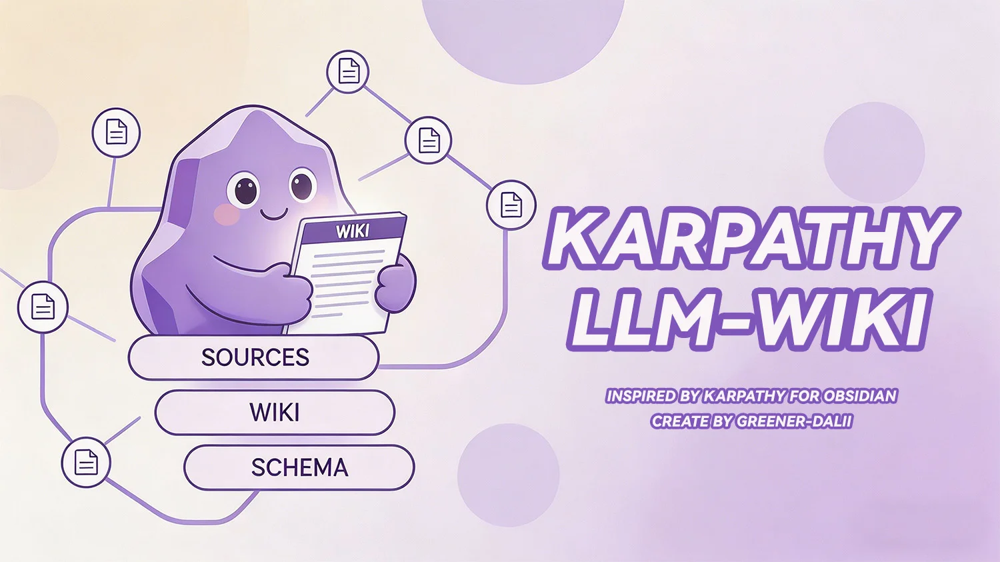

# 🧠 Karpathy LLM Wiki — Obsidian 插件

> 基於 [Andrej Karpathy 的 LLM Wiki 概念](https://gist.github.com/karpathy/442a6bf555914893e9891c11519de94f) 實現的知識庫生成系統，自動從筆記中提取實體與概念，構建互聯的 Wiki 頁面。
>
> **Obsidian 官方評分 95/100** | 原生支持 10 種語言 | 活躍維護，持續進化

[](https://deepwiki.com/green-dalii/obsidian-llm-wiki) [](https://github.com/green-dalii/obsidian-llm-wiki/actions/workflows/release.yml)          

[English](../README.md) | [简体中文](README_CN.md) | **繁體中文** | [日本語](README_JA.md) | [한국어](README_KO.md) | [Deutsch](README_DE.md) | [Français](README_FR.md) | [Español](README_ES.md) | [Português](README_PT.md) | [Italiano](README_IT.md)

[官網](https://llmwiki.greenerai.top/) | [博客](https://llmwiki.greenerai.top/zh/blog/) | [反饋討論](https://github.com/green-dalii/obsidian-llm-wiki/discussions) | [🤖 用 DeepWiki 讀懂代碼庫](https://deepwiki.com/green-dalii/obsidian-llm-wiki)

---

> **⚡ 快速更新提醒：** 本項目迭代速度快，會經常進行 Bug 修復、性能提升或新功能、體驗優化等。建議經常在 Obsidian 中更新到最新版本（**設置 → 社區插件 → 檢查更新**），或開啓插件的自動更新功能以確保獲得最佳體驗。
## 📑 目錄

- [🧠 Karpathy LLM Wiki — Obsidian 插件](#-karpathy-llm-wiki--obsidian-插件)
  - [📑 目錄](#-目錄)
  - [💡 什麼是 LLM-Wiki？](#-什麼是-llm-wiki)
  - [⚡ 爲什麼選擇 Obsidian + LLM-Wiki？](#-爲什麼選擇-obsidian--llm-wiki)
  - [🚀 快速開始](#-快速開始)
    - [📦 安裝](#-安裝)
    - [🔄 更新插件](#-更新插件)
    - [🔑 配置 LLM Provider](#-配置-llm-provider)
    - [🎮 使用方式](#-使用方式)
    - [⚠️ 從舊版本升級？](#️-從舊版本升級)
  - [⚡ v1.22.0 更新內容](#-v1220-更新內容)
    - [v1.22.1 — 2026-06-24 (PATCH)](#v1221--2026-06-24-patch)
    - [v1.22.2 — 2026-06-26 (PATCH)](#v1222--2026-06-26-patch)
    - [v1.22.3 — 2026-06-26 (PATCH)](#v1223--2026-06-26-patch)
    - [v1.22.4 — 2026-06-27 (PATCH)](#v1224--2026-06-27-patch)
    - [v1.22.5 — 2026-06-29 (PATCH)](#v1225--2026-06-29-patch)
    - [v1.22.6 — 2026-06-29 (PATCH)](#v1226--2026-06-29-patch)
  - [✨ 核心特性](#-核心特性)
    - [📊 知識質量](#-知識質量)
    - [🛠️ 維護能力](#️-維護能力)
    - [💬 查詢與反饋](#-查詢與反饋)
    - [🌐 LLM 與語言](#-llm-與語言)
    - [🏗️ 架構與性能](#️-架構與性能)
    - [🔒 隱私與安全](#-隱私與安全)
  - [⌨️ 命令列表](#️-命令列表)
  - [📖 使用示例](#-使用示例)
  - [🤖 模型選擇建議](#-模型選擇建議)
  - [🏗️ 架構](#️-架構)
  - [❓ 常見問題 (FAQ)](#-常見問題-faq)
    - [💡 通用](#-通用)
    - [🏷️ 別名與重複](#️-別名與重複)
    - [⚡ 性能與成本](#-性能與成本)
    - [🧹 維護](#-維護)
    - [🔍 故障排查](#-故障排查)
  - [🔒 透明度與合規性](#-透明度與合規性)
  - [📜 許可證](#-許可證)
  - [🙏 致謝](#-致謝)
  - [Star History](#star-history)
---

## 💡 什麼是 LLM-Wiki？

你寫筆記，AI 來整理，你開口問。就這麼簡單。

**🎯 痛點。** 你的筆記是個金礦——人物、概念、觀點、關聯。但現在它們只是文件夾裏的一堆文檔。找到誰跟誰有關，只能靠搜索、打標籤，以及祈禱自己還記得那條線索。

**✨ 思路。** [Andrej Karpathy 提出了](https://gist.github.com/karpathy/442a6bf555914893e9891c11519de94f)一個優雅的方案：把筆記當原材料，讓 LLM 來做架構師。它讀你寫的東西，提取實體和概念，編織成一個結構化的 Wiki——帶 `[[雙向鏈接]]`、自動索引，還能用自然語言對你的知識庫提問。

**📚 你不再是圖書管理員。** 不用糾結該給誰建頁面，不用手工維護交叉鏈接，不用擔心信息過時。筆記丟進 `sources/`，LLM 自動閱讀、提取、撰寫、鏈接，甚至標記矛盾——你只管繼續寫。

**🤖 也不是另一個聊天機器人。** ChatGPT 瞭解互聯網，LLM-Wiki 瞭解*你*——準確說，是你教給它的東西。每個回答都帶着 `[[wiki-links]]` 回到你的知識圖譜。每條回覆都是一條探索路徑的起點，而不是終點。

---

## ⚡ 爲什麼選擇 Obsidian + LLM-Wiki？

Obsidian 是鏈接思考的利器。但有個問題：連線的那個人一直是你自己。

LLM-Wiki 把這個關係翻轉了。不是你手工構建圖譜，而是 AI 隨着你的筆記一起成長。你寫一篇新筆記——它幫你找出你可能會錯過的關聯。你提一個問題——它在你自己的知識圖譜裏穿行，帶着引用回來見你。

- **🔗 你的圖譜視圖活起來了。** 新筆記不再靜靜躺在文件夾裏——它們自動生長出指向實體、概念和來源的鏈接。圖譜有機生長，插件持續維護：檢測重複、修復斷鏈、用別名橋接不同語言。
- **💬 你的筆記學會了對話。** 搜索變成了聊天。"我之前寫過什麼關於 X 的內容？"變成了對話，流式回答帶着 `[[wiki-links]]` 作爲路標。每個回答都是深入你自己知識的一條路徑。
- **🧠 Obsidian 成爲你的思考夥伴。** 它不再只是裝筆記的櫃子，而是幫你*思考*的東西——浮現隱藏的關聯、標記矛盾、記起你忘了自己知道的事。

---

## 🚀 快速開始

### 📦 安裝

**🌟 推薦 — Obsidian 社區插件市場：**

1. 在 Obsidian 中打開 **設置 → 第三方插件**
2. 點擊 **瀏覽**，搜索 "Karpathy LLM Wiki"
3. 點擊 **安裝**，然後 **啓用**

**🌐 或從社區插件網站安裝 —** 訪問 [community.obsidian.md/plugins/karpathywiki](https://community.obsidian.md/plugins/karpathywiki)，點擊 **Add to Obsidian** 即可直接安裝。

**⚙️ 手動安裝（備用）：**

1. 從 [Releases](https://github.com/green-dalii/obsidian-llm-wiki/releases) 下載 `main.js`、`manifest.json`、`styles.css`
2. 在 Obsidian 中打開 設置 → 第三方插件，在 **已安裝插件** 標籤頁點擊文件夾圖標，打開插件目錄
3. 新建一個 `karpathywiki` 文件夾，將三個文件放入其中
4. 回到 Obsidian，點擊刷新圖標 — **Karpathy LLM Wiki** 會出現在已安裝插件列表中
5. 打開開關啓用

**🔨 開發構建：** `git clone` 後執行 `pnpm install` 和 `pnpm build`。

### 🔄 更新插件

本項目迭代迅速，新功能、修復和改進會頻繁發佈。建議保持更新：

**方式一 — 手動更新（推薦）：**
1. 打開 **設置 → 第三方插件**
2. 點擊 **檢查更新**
3. 在列表中找到 **Karpathy LLM Wiki**，點擊 **更新**

**方式二 — 開啓自動更新：**
1. 打開 **設置 → 第三方插件**
2. 開啓 **自動檢查插件更新**
3. 新版本會被自動檢測，你可以擇機手動更新

> 💡 **爲什麼要保持更新？** 每次發佈都可能包含新功能、性能優化和重要修復。我們會積極維護此插件——錯過更新意味着錯過更好的體驗。

### 🔑 配置 LLM Provider

1. 打開 設置 → Karpathy LLM Wiki
2. 從下拉菜單選擇 Provider（Anthropic、Anthropic 兼容、Google Gemini、OpenAI、DeepSeek、Kimi、GLM、MiniMax、LM Studio、Ollama、OpenRouter 或自定義）
3. 填入 API Key（Ollama 不需要）
4. 點擊 **獲取模型列表** 填充模型下拉框，或手動輸入模型名
5. 點擊 **測試連接**，然後 **保存設置**

**Ollama 本地模型（無需 API Key）：** 安裝 [Ollama](https://ollama.com)，拉取模型（如 `ollama pull gemma4` 或 `ollama pull qwen3.5:27b`），在 Provider 下拉選擇 "Ollama (本地)"。

**LM Studio 本地模型（無需 API Key）：** 安裝 [LM Studio](https://lmstudio.ai)，啓動其本地服務（默認 `http://localhost:1234/v1`），在 Provider 下拉選擇 "LM Studio（本地）"。LM Studio 內置 OpenAI 兼容服務，API Key 字段可選。

**Anthropic 兼容（Coding Plan）：** 如果你的服務商提供 Anthropic 兼容的 API 端點（常見於 Coding Plan 訂閱），選擇 "Anthropic 兼容"，填入服務商提供的 Base URL 和 API Key。

### 🎮 使用方式

| 方式 | 操作 |
|------|------|
| **📥 攝入單個源文件** | `Cmd+P` → "攝入單個源文件" — 選擇特定筆記文件，提取實體和概念生成 Wiki 頁面 |
| **📂 從文件夾攝入** | `Cmd+P` → "從文件夾攝入" — 選擇文件夾，批量處理其中所有筆記 |
| **🔍 查詢 Wiki** | `Cmd+P` → "查詢 Wiki" — 對話式提問，流式回答中自帶 `[[wiki-links]]` |
| **🛠️ 維護 Wiki** | `Cmd+P` → "維護 Wiki" — 健康掃描：重複頁面、斷鏈、孤立頁面、空洞頁面、缺失別名、雙重嵌套鏈接自動修復 |
| **📋 重新生成索引** | `Cmd+P` → "重新生成索引" — 重新構建 `wiki/index.md`，包含別名信息 |
| **⏹️ 取消當前操作** | `Cmd+P` → "取消當前提取" 或點擊狀態欄 — 在批次邊界安全停止提取或 Lint，保留已完成的工作 |
| **🎯 ribbon 一鍵攝入** | 點擊左側邊欄 `sticker` 圖標或 `Cmd+P` → "攝入當前文件" — 直接攝入當前打開的文件 |

重複攝入同一源文件時，實體/概念頁以增量方式合併新信息，摘要頁會重新生成。

**批量智能跳過：** 文件夾攝入時，外掛自動檢測已處理文件並跳過，節省時間和 API 成本。批量報告顯示跳過計數。


**批量智能跳過：** 文件夾攝入時，插件自動檢測已處理文件並跳過，節省時間和 API 成本。批量報告顯示跳過計數。

### ⚠️ 從舊版本升級？

**本次發佈完全向後兼容。** 自 v1.0.0 起無任何破壞性變更——你現有的 Wiki 頁面、設置和工作流全部保留，無需重新配置或數據遷移。

**從任意早期版本升級到 v1.20.3**：源頁面 slug 現在會帶指紋（每個 `sources/<slug>.md` 變爲 `sources/<基名>_<6位hex>.md`）。在你下次攝入時，已有的 `sources/` 頁面會原地重命名，所有 `[[sources/<slug>]]` 反向鏈接會自動更新——無需任何操作，但 Obsidian 文件瀏覽器中可能會短暫顯示文件重命名。如果你有外部腳本或書籤直接引用 `sources/<slug>.md` 路徑，請更新爲新的帶指紋路徑。

**如果你的現有 Wiki 跨多個版本構建而成**，部分頁面可能缺少近期新增的能力（別名、別名感知去重、提示詞現代化）。運行 **維護 Wiki (Lint Wiki)** 查看需要處理的項目。**一鍵智能修復 (Smart Fix All)** 可一站式處理最常見的清理任務。

**如果從 v1.16.0 之前的版本升級**，建議運行一次 **維護 Wiki (Lint Wiki)** 以自動修復以下歷史遺留問題：
- **雙重嵌套鏈接 `[[[[entities/Foo|Foo]]]]`**：log.md 中可能存在格式異常的鏈接，Lint 會自動檢測並修復，零 LLM 成本
- **對側目錄重複 stub**：entities/ 和 concepts/ 中同名的重複頁面現在能被正確識別並匹配

**如果你的 Wiki 跨多箇舊版本構建**，請按以下步驟將其更新到當前標準：

**1️⃣ 重建索引**
`Cmd+P` → **"重新生成索引"** — 重新構建 `wiki/index.md`，爲每個頁面附加別名條目，啓用別名感知搜索（如搜索"DSA"能找到"DeepSeek-Sparse-Attention"）。舊版索引格式只列出頁面標題。

**2️⃣ 運行維護 Wiki**
`Cmd+P` → **"維護 Wiki"** — 掃描整個 Wiki，顯示：
- **🏷️ 缺失別名**：沒有別名的頁面（任何未運行過"Complete Aliases"的版本）。點擊 **"Complete Aliases"** 讓 LLM 批量生成翻譯、縮寫、變體名。這對後續重複檢測至關重要。
- **🔄 重複頁面**：內容重疊的頁面（如"CoT"與"思維鏈"，舊版沒有別名感知去重機制）。點擊 **"Merge Duplicates"** 合併並保留所有別名。
- **💀 斷鏈 / 空洞頁面 / 孤立頁面**：常規 Wiki 維護問題。

**3️⃣ 使用一鍵智能修復**
在 Lint 報告中點擊 **"Smart Fix All"**，按因果關係順序自動修復：補全別名 → 合併重複 → 修復斷鏈 → 鏈接孤立頁 → 擴充空洞頁。這是清理跨版本遺留問題的最快方式。

**4️⃣ 啓用並行頁面生成**
設置 → **LLM 配置（LLM Configuration）**：
- **⚡ 頁面生成併發度**：大多 Provider 建議設置爲 3。含 10+ 實體的源文件可加速 2–3 倍。
- **⏱️ 批次延遲**：從 300ms 開始。如遇限流請增大至 500–800ms。

**5️⃣ 檢查當前設置項：**
- **🌐 Wiki 輸出語言**：獨立於界面語言——Wiki 可以用中文撰寫而插件界面保持英文，反之亦然。
- **📊 提取粒度**：五種選項控制 LLM 從源文件提取實體的深度：
  - **精細**（約100個）— 深度分析，邊緣提及也包含。高 token 成本，適合關鍵源文件。
  - **標準**（約50個）— 平衡提取。日常筆記的良好默認。
  - **粗略**（約10個）— 快速概覽，僅核心實體。低成本，快速攝入。
  - **極簡**（約5個）— 僅核心條目。批量處理 100+ 文件或測試新源文件的首選。
  - **自定義**（1–300個）— 用戶自定義實體/概念上限，適配特殊工作流。
  > 💡 **推薦**：批量處理大文件夾時使用極簡或粗略以節省時間和 API 成本。精細選項僅選擇性用於值得深度分析的關鍵文檔。
- **🔄 自動維護**：可選的文件監聽、定時 Lint、啓動健康檢查。Startup Quick Fixes 默認開啓（一次性啓動健康檢查）；File Watcher 與 Periodic Lint 默認關閉——僅在需要後臺自動處理時啓用。

> **🛡️ 安全說明**：並行生成使用 `Promise.allSettled` —— 某頁失敗不影響其他頁面繼續。失敗頁面會自動重試並指數退避。智能批量跳過自動檢測已攝入文件，節省時間和 API 成本。

---

## ⚡ v1.22.0 更新內容

v1.22.0 是一個**次要功能版本**，帶來長期期待的 Schema 一鍵更新工作流、繁體中文作爲第 10 種語言，以及改進的攝取狀態欄。

- **📝 Schema 一鍵應用（Issue #97）。** LLM 生成的 Schema 優化建議現在在 IDE 風格的雙欄 diff Modal 中顯示，提供「應用」/「取消」/「打開文件」按鈕。應用建議時會自動備份當前 Schema（輪轉保留最多 3 份），然後寫入新內容。更新 Schema 現在通過 Lint Modal 訪問——命令面板入口已移除，強制單一入口點。
- **🏷️ Schema 動態標籤同步。** Schema 詞表現在是唯一事實來源——活動標籤自動注入每次 LLM 調用，消除了 v1.21.0 Phase 1 中「Schema 模板被硬編碼覆蓋」的 Bug。
- **🇹🇼 繁體中文（zh-TW）語言。** 插件 UI 和 Wiki 輸出現在支持繁體中文作爲第 10 種語言。雙向一致性保護已擴展到所有 10 種語言。
- **📊 攝取狀態欄顯示文檔名稱（PR #189）。** 狀態欄現在顯示當前文檔名稱（`My Note · 提取中... 點選取消`），文件夾批量攝取時顯示進度（`[4/10] My Note · 提取中... 點選取消`）。由 @YounianC 貢獻。

### v1.22.1 — 2026-06-24 (PATCH)

聚焦的 PATCH 版本，修正了使用者回報的三個 P0 錯誤，並帶來一項 UX 改進。

- **🛡️ 修復死鏈不再偽造 AI 擴充的存根頁面 (#197)。** 當 `fixDeadLink` 無法解析死鏈時，先前會建立存根並呼叫 `fillEmptyPage()` —— 讓 LLM 在零源內容的情況下虛構 alias 與相關連結。存根現在是誠實的佔位，帶有 `generation_complete: false` 標記，便於 #170 incomplete-cleaner 識別，下一次真實攝入時透過正常路徑填入。
- **✅「啟動時執行快速修復」開關真正生效 (#199)。** v1.18.3 的 migration 在每次外掛載入時強制把 `startupCheck: false` 改回 `true`，靜默撤銷使用者的明確選擇。該 migration 已移除；剩餘的遷移被抽取為 `core/settings-migrations.ts` 中的純函式 `applySettingsMigrations()`。新裝預設開啟，明確選擇被尊重。
- **🎨 CSS `:has()` 審核警告已修復。** `.modal:has(.llm-wiki-schema-diff-modal)` 替換為直接的 class 選擇器。新的 `scripts/css-lint.mjs` 多規則 lint 同時檢查 `!important` 和 `:has()`，已接入 Gate 1 防止回退。
- **🪟 Query Wiki 現在是 Copilot 風格右側側邊欄面板 (#196, @YounianC)。** `QueryModal extends Modal` 改為 `QueryView extends ItemView` —— 對話可以與筆記並排顯示，不再以彈窗打斷。`message-circle` 功能區圖示和 `Query Wiki` 指令啟動/顯示右側 sidebar leaf（若已存在則複用）。所有功能保持不變：分級檢索、串流與非串流回退、可摺疊思考面板、儲存到 Wiki、history。樣式改為原生 `var(--…)` 主題權杖，自動適配 light/dark 主題。
- **🧹 相關連結前綴確定性重寫 (#200, @DocTpoint, #187)。** LLM 生成的「相關概念 / 相關實體」條目在目標超出截斷的現有頁面清單時偶爾會預設輸出 `[[sources/<slug>]]` —— 或同一批次攝入中尚未建立。新的純函式 `correctRelatedLinkPrefixes()` 在生成後重新宣告每個相關名稱的已知類型。受 header label 限定的 section 範圍，保證「來源中的提及」裡的合法 `[[sources/<slug>]]` 引用不會被改寫；同時也能自我修復透過 `mergePage` 攜帶的陳舊連結。

建議升級 —— fix-dead-link 的存根偽造 bug 類已被關閉，Query Wiki 側邊欄讓對話時筆記保持可見。

完整變更請參閱 [CHANGELOG.md](../CHANGELOG.md)。

### v1.22.2 — 2026-06-26 (PATCH)

此 PATCH 版改進了自動攝入的體驗、本地化了操作日誌、清理了死代碼。

- **📋 自動攝入不再彈出阻斷彈窗 (Issue #204)。**
- **🔧 Auto Smart Fix 彈窗 → 短暫通知。**
- **🌐 操作日誌現支援 10 語言。**
- **📅 定時維護：移除"每小時"，新增"每月"。**
- **🧹 死代碼清理。**
- **⚙️ 自動攝入通知設定（條件顯示）。**
- **♻️ 日誌頭部自動遷移。**

### v1.22.3 — 2026-06-26 (PATCH)

聚焦的 Hotfix，加固 v1.22.2 log header 機制，並防止非內容檔案被污染 frontmatter。

- **🔧 log header 偵測現在語言無關且穩健。** 從基於文字的偵測（德/日/韓語無法辨識，且 log entry 正文裡的常見片語會誤判）改為嵌入 header 的結構性 `<!-- llm-wiki-log-header-start -->` HTML 註解標記。已存在的 v1.22.2 log 檔案將在下次啟動時自動升級。
- **🧹 log header 字串合併到 `src/texts/<lang>.ts`。** 原本在 `core/log-header.ts` 重複維護的 4 個本地化 header 字串現在與其他所有 UI 文字放在一起，翻譯工作和一致性測試自動覆蓋。
- **🚫 不再向 `log.md` / `index.md` / `schema/` 寫入 `generation_complete`。** `createOrUpdateFile` 之前對**所有**寫入的檔案呼叫 `markPageComplete`，會對沒有 frontmatter 的檔案 prepend 一個全新的 frontmatter 區塊（含 `generation_complete: true`），明顯污染 log.md 正文。新的 `isInWikiContentFolder()` guard 將 stamp 限制在 `wiki/{entities,concepts,sources}/...` 三個目錄下。

建議升級 —— log.md 不再每次快速修復時累積雜散 frontmatter，偵測在所有語言下都按統一規則工作。

### v1.22.4 — 2026-06-27 (PATCH)

聚焦的 PATCH：恢復 GPT-5.x 模型可用性、將 Provider 真實錯誤訊息透傳到 Test Connection 介面，並集中管理 lint 效能調校參數。

- **🛡️ GPT-5.x 模型不再以 400 失敗 Test Connection（Issue #207）。** v1.20.0 用的 `params.model.startsWith('gpt-5-')` 硬編碼前綴比對只覆蓋帶短橫線的 OpenAI gpt-5 系列（`gpt-5-mini`、`gpt-5-nano` 等），每次 OpenAI 發佈新 gpt-5.x（`gpt-5.1`、`gpt-5.4-mini`、`gpt-5.5`）就靜默失效。改為執行階段探測-快取機制：首次請求用 `max_tokens`，若後端以 400 拒絕則快取備用 key（`max_completion_tokens` 或反之）並重試。後續請求複用快取——不再依賴模型名前綴比對，未來 OpenAI 任何新的命名規則都能自動適配。
- **📜 Provider 真實錯誤訊息現在能到達 Test Connection 介面。** 之前 `requestUrl` 拋出的錯誤被重新包裝為 `status 400: ${data.error.message}`（若回應體遺失則只剩 "status 400"），Provider 的真實錯誤（如 "Invalid parameter: max_tokens should be max_completion_tokens"）使用者完全看不到。新的 `extractProviderErrorMessage()` enrich 拋出的錯誤，讓使用者看到可操作的 Provider 詳情，而不是泛泛的 HTTP 狀態碼。
- **♻️ Lint 效能調校參數集中到 `src/constants.ts`。** 事件循環讓步節奏（`LINT_YIELD_EVERY_OUTER` / `_PHASE1` / `_COMPARISON`）、候選批次大小（`LINT_CANDIDATE_TOKEN_ESTIMATE`、`LINT_MAX_INPUT_TOKENS`、`LINT_DEDUP_BATCH_SIZE`）、準備階段批量讀（`LINT_PREP_BATCH_READ`），以及 source-analyzer 批次大小（`SHORT_CONTENT_THRESHOLD`、`BATCH_CHARS_PER_ITEM`）現在統一在一個檔案。之前這些值在 `controller.ts`、`duplicate-detection.ts`、`preparation.ts`、`batch-limits.ts` 四個檔案裡重複定義且已漂移——包括一個 `MAX_TOKENS=16000` 是 `MAX_TOKENS_BATCH` 字面副本。Lint 效能調校現在是單檔案改動。

建議升級 —— gpt-5.x 模型開箱即用，Test Connection 介面會準確告訴你 Provider 拒絕了什麼，不必再翻控制台排查 baseUrl / 模型名 / API key。

### v1.22.5 — 2026-06-29 (PATCH)

聚焦的 PATCH：修復 OpenAI 推理模型族（gpt-5.1+ / gpt-5.5 / o1-o4）在 Test Connection 上的 400 錯誤（Issue #207 後續跟進），並將 Provider 真實錯誤訊息透傳到 Test Connection Notice。

- **🛡️ 推理模型族現走 OpenAI Responses API（Issue #207 後續）。** v1.22.4 的 `max_tokens` ↔ `max_completion_tokens` 探測快取修復是必要但不充分的——`gpt-5.1-chat-latest`、`gpt-5.5` 以及 `o1` / `o3` / `o4-mini` 推理家族在 Chat Completions 端點仍報 400 錯誤，原因是 Chat Completions 對推理模型族存在相容性問題。OpenAI 官方 GPT-5.5 遷移指南明確指出「GPT-5.5 works best in the Responses API」，v1.22.5 因此將推理家族路由到 `/v1/responses` 並附帶 `reasoning: { effort: 'low' }`。`gpt-5-chat-latest`、`gpt-4.1`、`gpt-3.5-turbo` 以及所有非 OpenAI baseUrl（Ollama、LM Studio、DeepSeek 等）保持 `/v1/chat/completions` 路徑不變。檢測邏輯是純函式 `isResponsesApiModel(model, baseUrl)`，僅在 `https://api.openai.com/v1` 觸發——自訂端點完全相容。
- **📜 Provider 錯誤訊息體到達 Test Connection Notice。** Obsidian 的 `requestUrl` 在 4xx（含 429）上拋錯但**不**把 Provider 回應體掛到 Error 物件上——所以 v1.22.4 的 `extractProviderErrorMessage()` 也拿不到 OpenAI 實際說的什麼。v1.22.5 在失敗請求上包一層 `window.fetch` 重新擷取（5 秒逾時），把 Provider body 合併到拋出的 `Error.message` 裡，使用者看到的是 `"status 429: You exceeded your current quota, please check your plan and billing details"` 而不是裸 `"status 429"`。原始 body 同時透過 `console.warn` 級別寫入 DevTools 方便排查。非 OpenAI baseUrl 走原有 Chat Completions 路徑獲得相同增強。
- **⏱️ 429/5xx 限流錯誤在 Responses API 路徑上獲得指數退避重試。** v1.22.4 的 `withRetry`（3 次嘗試，1s/2s/4s + 抖動）原本只覆蓋 Chat Completions 路徑。v1.22.5 把新 Responses API 路徑也包了同樣的 `withRetry`，瞬時 429 配額顛簸不再立即讓 Test Connection 失敗。
- **♻️ 測試夾具更新。** v1.22.4 時期針對 dot-naming gpt-5.x 模型的迴歸測試，以及 `thinking.type='disabled'` 遺留 Chat Completions 路徑的測試，現在分別使用 `gpt-5-mini` / `gpt-5-nano` / `gpt-4.1`——這些模型繼續走 Chat Completions 路徑，而推理模型族由新的 `src/__tests__/root/llm-client-responses-api.test.ts`（28 測試）完整覆蓋。

建議升級 —— `gpt-5.1-chat-latest`、`gpt-5.5`、`o1` / `o3` / `o4-mini` 家族在 Test Connection 上開箱即用，連線失敗時顯示的是 Provider 真實錯誤（如 "insufficient_quota"）而不是裸 HTTP 狀態碼。

### v1.22.6 — 2026-06-29 (PATCH)

聚焦的 PATCH：把 `onAutoIngestDone` 接入 Watch Mode 自動擷取路徑（Issue #204），讓 Auto Smart Fix 完成提示具備上下文感知能力，並把 OpenAI Responses API 路由擴展到 `gpt-5.x-pro` 變體（Issue #207 後續跟進）。

- **🤫 自動擷取終於尊重 `autoIngestNotificationLevel: notice` 設定（Issue #204）。** v1.22.2 引入了 `onAutoIngestDone` 輔助方法走 Notice 路徑，但從未接入 Watch Mode 自動擷取流程——每次自動擷取完成都走 `onIngestDone`（永遠開啟 `IngestReportModal`），導致設定面板裡「Notice（非阻塞）」選項完全失效。v1.22.6 在 `IngestReport`（和 `IngestOptions`）上新增 `trigger?: 'auto' | 'manual'` 欄位，沿 `WikiEngine.ingestSource` → `onDone` 傳遞，並把 `trigger='auto'` 路由到 `onAutoIngestDone`。手動擷取行為不變。升級後，之前的「Notice」設定真正生效——自動擷取完成時是臨時 Notice + History 面板提示，不再奪取焦點。
- **🔇 Auto Smart Fix 完成提示同樣具備上下文感知。** 同樣的 trigger 模式應用到 `runLintWiki`（新增第三個 `trigger` 參數，預設 `'manual'`）。`AutoMaintainManager.schedulePeriodicLint` 傳 `trigger='auto'`。完成分發：手動 → `LintReportModal`（原 UX 不變）；自動 + `autoSmartFix=true` → Notice + 跑 fixAll（沿用 v1.22.2 路徑）；自動 + `autoSmartFix=false` → 僅 Notice 帶 History 面板提示，不彈模態框。即使沒啟用 Auto Smart Fix，週期性的自動 lint 也不再打斷你寫作。
- **🛡️ GPT-5 Pro 變體（`gpt-5.x-pro`）現在路由到 `/v1/responses`（Issue #207 後續）。** 已透過 OpenAI 官方模型頁（`developers.openai.com/api/docs/models/gpt-5-pro`）驗證：「GPT-5 Pro is available in the Responses API only.」v1.22.5 的 `RESPONSES_API_MODEL_RE` 匹配 `gpt-5.x` 但漏了 `-pro` 後綴，導致 `gpt-5.2-pro` / `5.4-pro` / `5.5-pro` 靜默走到了 `/v1/chat/completions` 而 Pro 模型在那裡根本不存在 → 404。v1.22.6 把正則擴到 `^(gpt-5\.[1-9]\d*(?:-pro)?|o1(?:-mini|-preview)?|o3(?:-mini|-pro)?|o4-mini)$`。`gpt-5-chat-latest` 排除邏輯保留（按設計就是 Chat Completions 模型）。升級後 `gpt-5.x-pro` 應可工作；若 `gpt-5.x-chat-latest` 變體仍報 400，請貼出 Notice 完整文字（現在已帶 Provider body）以便進一步診斷。

建議升級 ——「自動擷取 Notice」設定終於生效，週期性自動 lint 不再中斷寫作，Pro 模型變體可經 Responses API 觸達。

我們強烈建議升級——Schema 一鍵應用功能使 Schema 優化成爲一步操作，繁體中文語言顯著改善 zh-TW 用戶的體驗。

詳見 [CHANGELOG.md](../CHANGELOG.md)。

## ✨ 核心特性

### 📊 知識質量

- **🔍 實體/概念提取** — LLM 從筆記中提取實體（人物、組織、產品、事件等）和概念（理論、方法、術語等），生成獨立 Wiki 頁面，支持靈活提取粒度（極簡~5個、粗略~10、標準~50、精細~100、自定義1–300）平衡分析深度與 API 成本
- **🏷️ 強制頁面別名** — 每個生成的頁面至少包含 1 個別名（翻譯、縮寫、變體名），支持跨語言重複檢測
- **🔄 重複檢測與合併** — 語義分級捕獲真正的重複頁面（跨語言翻譯、縮寫、拼寫變體）；智能 LLM 融合合併內容並保留別名
- **🧩 智能知識融合** — 多源更新時智能合併新信息不重複；矛盾保留並註明歸屬；`reviewed: true` 頁面受保護不被覆蓋
- **📏 內容截斷保護** — 8000 max_tokens，自動檢測 stop_reason 並以 2× token 重試，覆蓋所有 Provider
- **📝 原文引用保留** — 來源提及章節保留原語言引用，可選翻譯，確保可追溯性

- **🎨 自訂標籤詞彙 (v1.18.0)。** 設定 → Wiki → 標籤詞彙模式 → *自訂* 可定義自己的實體類型和概念類型標籤清單（例如 `Medical_Arzneimittel`、`法规`）。外掛在提取 prompt 和 frontmatter 校驗中都會尊重你的詞彙表；現有的 Lint 稽核 (#85 v7) 會報告任何使用了不在活動詞彙表內標籤的頁面。


### 🛠️ 維護能力

- **🔍 Lint 健康掃描** — 一次全面報告檢測：重複頁面、斷鏈、空洞頁面、孤立頁面、缺失別名、矛盾
- **🎯 語義分級重複檢測** — Tier 1（直接名稱匹配：跨語言、縮寫、高相似度標題）全部驗證；Tier 2（間接信號：共享鏈接、中等相似度）按 token 預算填充
- **⚡ 一鍵智能修復** — 按因果關係順序批量修復：補全別名 → 合併重複 → 修復斷鏈 → 鏈接孤立頁 → 擴充空洞頁，完成後彈窗報告各階段執行結果
- **🏷️ 別名補全** — 一鍵並行批量生成缺失別名，提升後續重複檢測準確率
- **🔄 自動維護** — 多文件夾監聽、定時 Lint、啓動健康檢查（均可選）
- **⚠️ 矛盾狀態機** — `檢測 → 審覈通過 → 已解決`（AI 修復）或 `檢測 → 待修復`（手動）
- **🛡️ 攝入前置檢查（v1.21.0）** — 在任何 LLM 調用之前驗證每個源文件：空文件/純空白/僅含 frontmatter 的筆記會被直接拒絕；通過內容哈希去重識別跨路徑的相同文件。防止小模型在空白輸入上編造實體名。
- **📊 操作歷史面板（v1.21.0）** — 可搜索、可篩選的 UI，用於查看歷史攝入、Lint 報告和維護運行記錄，含洞察驅動的 KPI 卡片和可點擊的頁面鏈接。


- **🧹 不完整頁面清理（v1.21.0）** — 中途中斷的攝入留下的半成品頁面會在啓動時自動歸檔至 Obsidian 的 `.trash`（可恢復）。

### 💬 查詢與反饋

- **🤖 對話式查詢** — ChatGPT 風格對話框，流式 Markdown 輸出，自帶 `[[wiki-links]]`，多輪歷史
- **🪟 右側停靠側邊欄 (v1.22.1, PR #196)。** Query Wiki 在 Copilot 風格的右側 sidebar leaf 中開啟（若已存在則複用），不再以居中彈窗出現。`message-circle` ribbon 圖示和 `Query Wiki` 指令啟動/顯示側邊欄，筆記與對話並排可見。所有功能保持不變。


- **📤 查詢到 Wiki 反饋** — 將有價值的對話保存到 Wiki，含實體/概念提取，保存前語義去重
- **🔒 重複保存防護** — Hash 跟蹤阻止未變化對話的重複評估

### 🌐 LLM 與語言

- **🔌 多 Provider 支持** — Anthropic、Anthropic 兼容（Coding Plan）、Gemini、OpenAI、DeepSeek、Kimi、GLM、MiniMax、LM Studio、OpenRouter、Ollama、自定義接口
- **🔄 5xx 自動重試** — 全部客戶端在 HTTP 5xx/429/529 錯誤時指數退避重試（最多 2 次）
- **📋 動態模型列表** — 從 Provider API 實時獲取
- **🌐 Wiki 輸出語言** — 9 種語言獨立於界面（英/中/日/韓/德/法/西/葡/意），支持自定義輸入
- **🌍 全界面國際化** — 插件 UI 支持 9 種語言（英/中/日/韓/德/法/西/葡/意），269+ UI 字段完整翻譯，自然本地表達
- **⚡ 速率限制守護** — 並行生成觸發限流時自動檢測並提示：降低併發度、增大批次延遲、切換 Provider
- **🦙 Web Clipper 高度兼容** — 一鍵添加官方 Obsidian Web Clipper 的 `Clippings/` 文件夾到監聽列表，網頁剪藏自動攝入 Wiki

### 🏗️ 架構與性能

- **⚡ 並行頁面生成** — 可配置 1–5 併發頁面，默認 3（並行），大源文件 2–3× 加速，單頁錯誤隔離
- **📚 迭代批量提取** — 自適應批次大小，消除長文檔的 max_tokens 瓶頸
- **🏛️ 三層架構** — `sources/`（只讀）→ `wiki/`（LLM 生成）→ `schema/`（共進化配置）
- **🧩 模塊化代碼庫** — 20+ 個聚焦模塊，位於 `src/`

### 🔒 隱私與安全

- **無後端、無追蹤。** 插件完全在 Obsidian 內部運行——沒有外部服務器、沒有數據分析、沒有任何形式的數據收集。除非你主動配置 LLM 提供商，否則你的筆記永遠不會離開你的 vault。
- **數據默認保留在本地。** 插件不會存儲、緩存或傳輸你的內容到你所選 LLM API 之外的任何地方。只有你發送用於攝入或查詢的文本會離開你的設備——且僅發往你配置的提供商。
- **通過 Ollama、LM Studio 或本地提供商實現完全本地模式。** 爲了完全的數據主權，請使用本地運行的 LLM。你的筆記完全在你的機器上處理——不觸碰互聯網。
- **最小化權限。** Vault 文件訪問用於 Wiki 管理（閱讀筆記、生成頁面、檢測死鏈）。網絡訪問僅用於與你所選提供商的 LLM API 通信。剪貼板訪問僅限於 Query 模態框中的"複製"按鈕——僅在您點擊時使用。

---
## ⌨️ 命令列表

| 命令 | 說明 |
|------|------|
| **📥 攝入單個源文件** | 選擇單個筆記 → 生成含實體、概念和摘要的 Wiki 頁面 |
| **📂 從文件夾攝入** | 選擇任意文件夾 → 從現有筆記批量生成 Wiki |
| **🔍 查詢 Wiki** | 對話式問答，流式輸出帶 `[[wiki-links]]` |
| **🛠️ 維護 Wiki** | 全面健康掃描：重複頁、斷鏈、空洞頁、孤立頁、缺失別名、矛盾 |
| **📋 重新生成索引** | 手動重建 `wiki/index.md` |
| **📊 查看攝入歷史（v1.21.0）** | 在可搜索、可篩選的 UI 中瀏覽歷史攝入、Lint 報告和維護運行 |

---

## 📖 使用示例

**輸入：** `sources/machine-learning.md`

```markdown
### Machine Learning
Machine learning uses algorithms to learn from data.

### Types
- Supervised learning
- Unsupervised learning
- Reinforcement learning
```

**輸出 — 實體頁：** `wiki/entities/supervised-learning.md`

```markdown
---
type: entity
created: 2025-12-01
updated: 2026-05-15
sources: ["[[sources/machine-learning]]"]
tags: [method]
aliases: ["監督學習", "Supervised Learning"]
---

### Supervised Learning

### 基本信息
- 類型：method
- 來源：[[sources/machine-learning]]

### 描述
監督學習是一種機器學習範式，模型從帶標籤的訓練數據中學習，
從而對未見數據做出預測……

### 相關概念
- [[concepts/Machine-Learning|Machine Learning]]
- [[concepts/Unsupervised-Learning|Unsupervised Learning]]

### 相關實體
- [[entities/Arthur-Samuel|Arthur Samuel]]

### 來源提及
- "Supervised learning uses labeled data to train predictive models..."
```

---

## 🤖 模型選擇建議

本插件遵循 Karpathy 的核心理念：**將完整 Wiki 上下文直接餵給 LLM，而非切成碎片做 RAG 檢索**。強烈推薦選擇長上下文窗口的模型——Wiki 越大，LLM 越需要足夠的上下文來保持跨頁面一致性。

> 💡 爲什麼不使用 RAG？Karpathy 在[原始構想](https://gist.github.com/karpathy/442a6bf555914893e9891c11519de94f)中指出，RAG 將知識碎片化，破壞了 LLM 在完整知識圖譜上的推理能力。

**💰 性價比優先策略：** 不必追求旗艦模型。以下**經濟實惠的替代方案**能以更低成本獲得出色效果：

| 檔位 | 模型 | 上下文窗口 | 推薦理由 |
|------|------|-----------|----------|
| **🌟 性價比首選** | **DeepSeek V4-Flash** | 1M tokens | 最低價($0.14/M)，284B MoE，批量攝入首選 |
| **🌟 性價比首選** | **Gemini-3.5-Flash** | 1M tokens | 輸出速度比 GPT-5.5 快 4 倍，智能體任務出色 |
| **🌟 性價比首選** | **Qwen3.6-Plus** | 1M tokens | 編碼和智能體能力強勁，價格有競爭力 |
| **🌟 性價比首選** | **Grok-4** | 2M tokens | xAI 2025-07 flagship, 2M context, strong reasoning & code tasks |
| **均衡型** | **Claude Sonnet 4.6** | 1M tokens | 質量與成本平衡佳，$3/$15 每百萬 token |
| **輕量型** | **Claude Haiku 4.5** | 200K tokens | 快速經濟，適合小型 Wiki |
| **經濟型** | **Xiaomi MiMo-V2.5** | 1M tokens | 小米 310B/15B MoE，2026-04 MIT 開源，Agent 與多模態 |
| **旗艦型** | Claude Opus 4.7 | 1M tokens | 極致質量，成本較高 — 選擇性使用 |
| **旗艦型** | GPT-5.5 | 1M tokens | 頂級推理，成本較高 — 選擇性使用 |

對於本地模型（Ollama）：上下文窗口通常較小（8K–128K），建議使用雲端 Provider 做攝入 + 本地模型做查詢。

**🔌 Anthropic Compatible (Coding Plan):** 如果你的 Provider 提供 Anthropic 兼容 API 端點，選擇 "Anthropic Compatible" 並輸入 Provider 的 Base URL 和 API Key。

> 💡 **訂閱套餐：** Coding Plan、OpenAI Pro 或 Anthropic Pro 等訂閱套餐是使用頻繁時控制成本的絕佳選擇。本插件支持這些服務。

---

## 🏗️ 架構

基於 Karpathy 的三層分離設計：

```
sources/     # 📄 你的源文檔（只讀）
  ↓ ingest
wiki/        # 🧠 LLM 生成的 Wiki 頁面
  ↓ query / maintain
schema/      # 📋 Wiki 結構配置（命名規範、頁面模板、分類規則）
```

**代碼結構** (`src/`)：

```
main.ts              # 🔌 插件入口
wiki/                # Wiki 引擎模塊
  wiki-engine.ts     # 🎯 編排器
  query-engine.ts    # 💬 對話查詢
  source-analyzer.ts # 📊 迭代批量提取
  page-factory.ts    # 🏗️ 實體/概念 CRUD + 合併
  conversation-ingest.ts # 📥 對話 → Wiki 知識
  contradictions.ts  # ⚠️ 矛盾檢測
  system-prompts.ts  # 🗣️ 語言指令 + 章節標籤
  lint/              # Lint 子模塊
    controller.ts        # 🔍 Lint 編排
    fix-runners.ts       # ⚡ 批量修復執行
    scanners.ts          # 🔍 掃描器（死鏈/孤立/別名/引用覈對）
    duplicate-detection.ts # 🔄 程序化候選生成
    report-builder.ts    # 📋 純函數報告生成
    phases/              # 分階段 Lint 執行
  prompts/           # 按域分類的 LLM 提示詞模板
schema/              # Schema 共進化
  manager.ts         # 📋 Schema CRUD + 建議
  auto-maintain.ts   # 🔄 文件監聽 + 定時 Lint + 啓動快速修復
  analyze.ts         # 📊 可取消的 Schema 分析
ui/                  # 用戶界面
  settings.ts        # ⚙️ 設置面板
  modals.ts          # 📦 Lint / Ingest / Query / History 彈窗
core/                # 🧩 純函數模塊（零 IO，可獨立測試）
  i18n, slug, json, frontmatter, tag-vocab, sources-normalizer, ...
+ 共享: llm-client.ts, llm-client-wrapper.ts, texts.ts, prompts.ts, types.ts
```

**生成的頁面結構：**
- `wiki/sources/文件名.md` — 📄 源文件摘要
- `wiki/entities/實體名.md` — 👤 實體頁（人物、組織、項目等）
- `wiki/concepts/概念名.md` — 💡 概念頁（理論、方法、術語等）
- `wiki/index.md` — 📑 自動生成的索引
- `wiki/log.md` — 📝 操作日誌

---

## ❓ 常見問題 (FAQ)

> **請保持插件更新。** 本項目迭代頻繁，新功能和修復每隔幾天就會推送。在 Obsidian 中定期前往 **設置 → 第三方插件 → 檢查更新** 以獲取最新版。
>
> 更多問題請參閱 [GitHub FAQ Discussion](https://github.com/green-dalii/obsidian-llm-wiki/discussions/28)。

### 💡 通用

**這個插件到底能做什麼？**
你放入筆記，它提取人物、概念和理論，生成互聯的 Wiki 頁面，帶 `[[雙向鏈接]]`。你可以提問，從*你的*筆記中獲取答案——而不是互聯網的幻覺。

**最低要求？**
Obsidian v1.11.0+，桌面端（Windows/macOS/Linux），LLM Provider API Key。Ollama 本地運行無需 API Key。參見上方 [配置 LLM Provider](#🔑-配置-llm-provider)。

**該選哪個模型？**
參見上方的 [模型選擇建議](#-模型選擇建議)。推薦長上下文模型——Wiki 越大，LLM 需要更多上下文。

### 🏷️ 別名與重複

**爲什麼 Lint 顯示大量頁面"缺失別名"？**
v1.7.11 之前生成的頁面不包含別名。這很正常——別名是增強功能，不是缺陷。在 Lint 報告中點擊 **Complete Aliases**，LLM 會批量生成翻譯、縮寫和變體名。有了別名後，重複檢測和別名搜索效果顯著提升。

**爲什麼會出現重複頁面（如"CoT"和"思維鏈"）？**
v1.7.10 之前沒有別名感知的重複檢測。運行 **Lint Wiki** → **Merge Duplicates** 合併。合併後的頁面保留雙方別名，防止未來再出現。

**重複檢測如何工作？（v1.7.10+）**
兩層語義檢測：第一層（LLM 始終驗證）捕獲跨語言匹配、縮寫、高相似標題。第二層填充剩餘預算，匹配中等相似度候選。別名對第一層至關重要——如果頁面是 v1.7.11 之前生成的，請運行 **Complete Aliases**。

**什麼是"污染頁面"？（v1.9.0）**
文件夾前綴被意外編入文件名的頁面，如 `concepts/concepts佈局優化.md`。運行 **Lint Wiki** → **🧹 Fix Polluted Pages** 即可重命名並更新所有入鏈。

### ⚡ 性能與成本

**如何加速攝入？**
在 **設置 → LLM 配置** 中：增加**頁面生成併發度**到 3–5（並行創建頁面），降低**批次延遲**到 100–300ms（注意限流風險）。選擇"極簡"、"粗略"或"標準"的**提取粒度**可減少產出的頁面數量並節省 API 成本。

**爲什麼遇到 HTTP 429 錯誤？**
插件會自動檢測限流模式並建議：降低併發度到 1–2，增大批次延遲到 500–800ms，或切換到更高限額的 Provider。

**如何控制 API 成本？**
- 自動維護默認關閉（僅在需要後臺處理時啓用）
- 智能批量跳過自動跳過已攝入文件
- "標準"或"粗略"粒度 = 更少 LLM 調用
- 批次延遲 > 500ms 僅間隔調用，不增加 token 消耗
- Lint 報告在運行修復前顯示計數，讓你判斷是否值得

### 🧹 維護

**Smart Fix All 做什麼？**
按因果關係順序運行修復（v1.9.0+）：
1. 🧹 修復污染頁面 → 2. 🏷️ 補全別名 → 3. 🔄 合併重複 → 4. 🔗 修復斷鏈 → 5. 🔗 鏈接孤立頁 → 6. 📝 擴充空洞頁

**Lint 在大 Wiki 上卡死？**
升級到 v1.7.17+——Lint 現在每 50 頁讓出給 Obsidian UI 線程，即使在 1200+ 頁的 Wiki 上也不會多秒卡死。

### 🔍 故障排查

**安裝後爲什麼不能使用攝入/維護/查詢功能？**
插件要求通過連接測試後才能使用核心功能。前往 **設置 → Karpathy LLM Wiki** → 選擇提供商 → 填入 API Key → 點擊 **Fetch Models** → 選擇模型 → 點擊 **Test Connection**。看到綠色 "LLM 已就緒" 指示後即可正常使用。這是爲了防止配置錯誤導致的靜默失敗。

**如何取消正在運行的攝入或 Lint？**
攝入運行時點擊狀態欄的 "提取中... 點擊取消" 文字，或使用 `Ctrl+P` → "取消當前提取"。操作會在當前批次完成後安全停止，保留所有已完成的工作。

**如何快速攝入當前正在編輯的文件？**
點擊左側邊欄的 `sticker` 圖標，或使用 `Ctrl+P` → "攝入當前文件"，無需文件選擇器，直接攝入當前活動編輯器中的文件。

**log.md 中出現 `[[[[entities/Foo|Foo]]]]` 雙重括號怎麼辦？**
運行一次 **維護 Wiki (Lint Wiki)** 即可——掃描器會自動檢測並修復整個 wiki 目錄（包括 log.md）中的所有雙重嵌套 wiki 鏈接，零 LLM 成本，無需手動清理。

**爲什麼會出現 "Overloaded" 錯誤？**
插件現在能識別 Anthropic 的 529 過載錯誤爲可重試。過載錯誤會自動以指數退避重試，適用於所有提供商。

**爲什麼 entities/ 和 concepts/ 中會出現重複的 stub 頁面？**
插件現在使用 slug 匹配機制——同名的不同格式（如空格 vs 連字符）能正確匹配到已有頁面，而非創建重複的 stub。

**Query 找不到我明知存在的頁面？**
三個常見原因：（1）索引過期 → **重新生成索引**。（2）缺少別名 → **Complete Aliases**。（3）換個說法——LLM 做語義匹配，不是關鍵詞搜索。

**可以手動編輯 Wiki 頁面嗎？**
可以。在 frontmatter 中設置 `reviewed: true` 可保護頁面不被覆蓋。手動添加的別名、標籤和來源在合併時保留。

**如何安全升級？**
插件不會修改你的源文件。備份 `wiki/` → 更新插件 → **重新生成索引** → **Lint Wiki** → 選擇性修復。

**升級到 v1.20.3 後我的 `sources/` 文件被重命名了，是出問題了嗎？（v1.20.3+）**
沒有 — 這是新的防衝突源頁面 slug 指紋機制生效。每個 `sources/<slug>.md` 現在變爲 `sources/<基名>_<6位hex>.md`（hex 是文件完整路徑的 FNV-1a 哈希）。跨文件夾同名文件（如 11 份 Academy 課程的 `About this course.md`）不再衝突。重新攝入會原地重命名已有的 `sources/` 頁面，所有 `[[sources/<slug>]]` 反向鏈接會自動更新。如果你有外部腳本或書籤指向 `sources/<舊slug>.md`，請更新爲新的帶指紋路徑。

**攝入不相關的源時，會覆蓋我用 `reviewed: true` 鎖定的頁面嗎？（v1.20.3+）**
不會 — Stage 4（`updateRelatedPage`）現在也尊重 `reviewed: true`，路由到 append-only 路徑，與攝入路徑一致。你審過的 body 原樣保留；只有真正的新內容纔會追加。

**我的本地模型（Ollama、LM Studio）在空白或僅含 frontmatter 的筆記上編造奇怪的實體名。（v1.21.0）**
v1.21.0 的攝入前置檢查已修復：空白/純空白/僅含 frontmatter 的筆記會在任何 LLM 調用之前被直接拒絕，內容哈希去重還會識別跨路徑的相同文件。升級到 v1.21.0+ 即可徹底消除"空文件幻覺"這類 bug（小模型在收到空白 prompt 時編造實體名）。

**如何獲得幫助？**
- [GitHub Issues](https://github.com/green-dalii/obsidian-llm-wiki/issues) — 提交 Bug
- [GitHub Discussions](https://github.com/green-dalii/obsidian-llm-wiki/discussions) — 提問與反饋

**如何收集調試日誌以排查問題？**

1. 打開開發者工具（`Ctrl+Shift+I` / `Cmd+Option+I`）
2. 切換到 **Console** 選項卡
3. 運行你的操作（攝入、查詢或 Lint）
4. 查找帶有模塊名前綴的消息，例如 `[Step]`、`[LLM]`、模塊名等
5. 本地測試時，使用 `pnpm build:dev` 替代 `pnpm build` 以保留完整調試輸出
6. 複製相關日誌行並附在你的 GitHub Issue 中 — 這能極大加快 bug 定位

---

## 🔒 透明度與合規性

本插件已上架 Obsidian 社區插件市場，並接受安全與權限的自動化審查。

**本插件沒有後端、沒有服務器基礎設施、不進行任何形式的數據收集。** 它是純粹運行在 Obsidian 內部的本地軟件。插件不能也不會有任何方式收集、存儲或傳輸你的數據到任何服務器——因爲這樣的服務器根本不存在。

**網絡訪問**僅用於與你配置的 LLM 提供商通信——不會進行其他網絡調用。這完全由你掌控：你選擇提供商、你輸入 API 密鑰、你決定數據發往何處。

**文件系統訪問**（vault 枚舉）用於構建和維護 Wiki：閱讀你的源筆記、生成頁面、掃描死鏈、檢測重複頁面。插件從不修改你的源文件——僅修改 wiki 文件夾下的文件。

**剪貼板訪問**僅用於 Query 模態框中的"複製"按鈕，且僅在你點擊時使用。

如果你希望數據完全保留在本地，請使用 Ollama 或 LM Studio 等本地 LLM 提供商。使用本地提供商時，你的數據永遠不會離開你的機器。
## 📜 許可證

MIT License — 詳見 [LICENSE](LICENSE)。

## 🙏 致謝

- **💡 概念來源：** [Andrej Karpathy 的 LLM Wiki](https://gist.github.com/karpathy/442a6bf555914893e9891c11519de94f) — 本插件的原始構想
- **🛠️ 開發平臺：** [Obsidian Plugin API](https://docs.obsidian.md/Plugins/Getting+started/Build+a+plugin)
- **🔌 LLM 傳輸層：** Obsidian `requestUrl`（Anthropic）+ 手寫的 OpenAI 兼容 HTTP 客戶端（其他 OpenAI 兼容 Provider）

## Star History

[](https://www.star-history.com/?repos=green-dalii%2Fobsidian-llm-wiki&type=timeline&legend=top-left)
